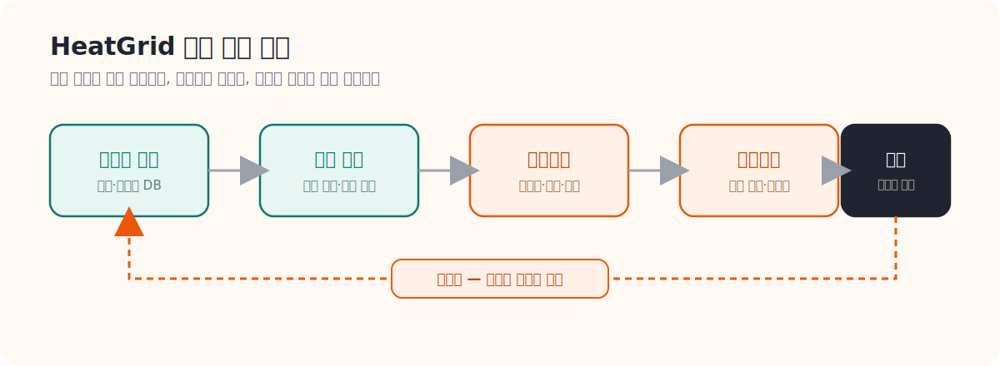
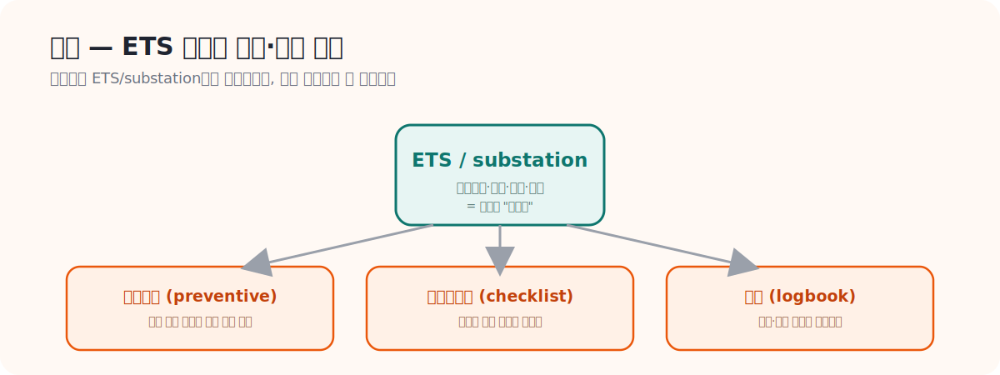
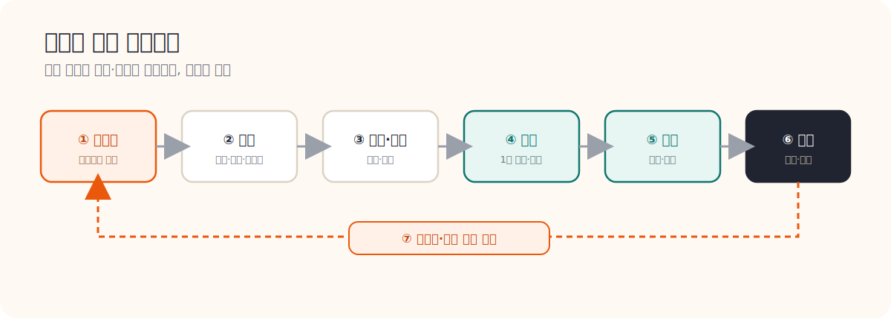
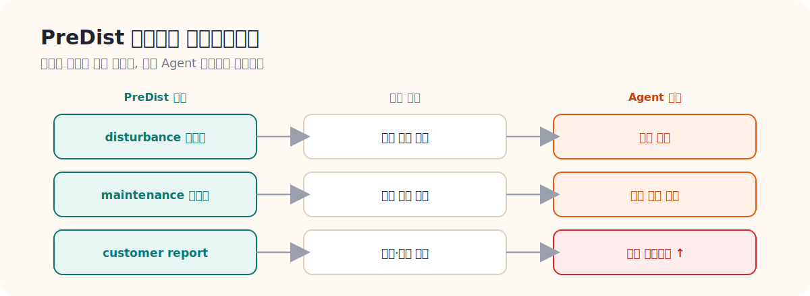

# HeatGrid Domain Guide

> **문서 역할**  
> 이 사이트에서 딱 하나만 읽는다면 이 문서다 / 초심자용 메인 가이드
> **대상 독자**  
> 지역난방 설비, 정비, 에너지 운영 도메인을 처음 접하는 사람
>
> **읽는 시간**  
> 20~25분
> **난이도**  
> 입문
>
> **선수지식**  
> 없음

---

## 0. 이 문서 하나로 충분합니다

이 사이트는 원래 00번부터 12번까지 13개 문서를 차례로 읽도록 만들어졌다. 그런데 처음 오는 사람에게는 "결국 뭘 읽어야 끝나는지" 감이 잘 안 잡힌다는 얘기를 들었다. 그래서 이 문서 하나에 핵심만 모았다. **다른 페이지로 넘어가지 않고 이 문서만 끝까지 읽어도 지역난방 기계실이 뭘 하는 곳인지, HeatGrid가 왜 필요한지 설명할 수 있게 되는 것**이 목표다. 더 깊이 알고 싶은 부분이 생기면 그때 각 섹션 끝에 있는 "더 보고 싶다면" 링크를 따라가면 된다.

쉽게 비유하면, 지역난방 기계실은 우리 동네 보일러실을 도시 규모로 키운 것과 비슷하다. 동네 보일러실이 한 건물에 따뜻한 물을 보내준다면, 지역난방 기계실은 여러 건물에 동시에 온수와 난방을 공급한다. 설비가 커지고 책임 범위가 넓어지는 만큼, 어디서 무슨 일이 생겼는지 빨리 알아채고 우선순위를 정해서 대응하는 게 훨씬 중요해진다. HeatGrid는 바로 이 "빨리 알아채고 먼저 할 일을 정하는" 역할을 도와주는 AI 시스템이다.

<strong>왜 지금 이 문서를 읽는가</strong>
HeatGrid는 단순히 "이상하다/정상이다"를 판정하는 모델이 아니다. 센서에서 잡힌 변화를 현장에서 무슨 일이 일어난 것인지로 해석하고, 그걸 다시 "지금 누가 가서 무엇을 먼저 점검해야 하는지"로 바꿔주는 시스템이다. 그래서 데이터만 알아도 부족하고, 현장 구조만 알아도 부족하다. 두 가지를 한 흐름으로 연결해서 봐야 한다.

### 자주 나오는 용어, 먼저 풀어두기

아래 8개 단어는 이 문서 전체에서 계속 나온다. 한 번만 훑어두면 뒤에서 막히지 않는다.

<strong>이 문서에서 자주 나오는 용어</strong>

- **PreDist**: 실제 지역난방 기계실에서 모은 센서 데이터와, 그 기간에 있었던 고장·정비·민원 기록을 같이 묶어놓은 공개 데이터셋 이름이다. "센서 숫자"와 "현장에서 실제 있었던 일"을 짝지어 볼 수 있게 해준다.
- **ETS / substation**: 해외에서 흔히 쓰는 말로, 우리가 "기계실"이라고 부르는 것과 거의 같은 의미다. 열을 받아서 건물 안으로 나눠주는 설비 묶음이다.
- **차압**: 배관에서 어느 한 지점과 다른 지점의 압력 차이다. 차압이 갑자기 커지면 어딘가 막혔다는 신호로 본다.
- **액추에이터**: 밸브를 실제로 열고 닫는 모터/구동 장치다. "밸브를 70%만 열어라"라는 명령을 받아서 실제로 그만큼 움직이는 부품이다.
- **fouling(파울링)**: 열교환기 안쪽에 찌꺼기나 스케일이 쌓여서 열이 잘 전달되지 않게 되는 현상이다. 사람으로 치면 혈관이 좁아지는 것과 비슷하다.
- **이상 점수(anomaly score)**: 지금 센서값이 평소 패턴과 얼마나 다른지를 숫자로 표현한 것이다. 점수가 높다고 무조건 고장은 아니고, "더 자세히 봐야 한다"는 신호에 가깝다.
- **리드타임**: 이상 신호가 처음 보이기 시작한 시점부터 실제 고장(또는 민원)으로 이어지기까지 걸리는 시간이다. 리드타임이 길면 미리 손쓸 여유가 있다는 뜻이다.
- **MQTT**: 센서나 설비가 인터넷으로 데이터를 주고받을 때 흔히 쓰는 가벼운 통신 방식이다. "센서 데이터가 서버로 가는 통로" 정도로 이해하면 된다.

### 지금 중요한 한 줄

HeatGrid에서 진짜 중요한 건 `센서값을 읽는 것` 자체가 아니라, `그 변화가 현장에서 무슨 의미인지 해석하고, 여러 개 중에 지금 뭘 먼저 봐야 하는지 정하는 것`이다. 이 한 줄을 이해하고 나면 아래 세 가지 질문에 자연스럽게 도달한다.

<h4>도메인 질문</h4>
기계실은 평소에 뭘 하고, 어떤 고장이 생기면 실제로 사람들이 불편을 느끼는가.

<h4>데이터 질문</h4>
PreDist의 컬럼 하나하나가 실제로 어떤 부품, 어떤 현상과 연결되는가.

<h4>Agent 질문</h4>
탐지된 이상을 어떤 순서, 어떤 작업지시로 바꿔야 현장에서 바로 쓸 수 있는가.

---

## 1. PreDist 데이터, 한 번에 이해하기

PreDist는 한마디로 "기계실의 평소 모습을 숫자로 적어둔 일기장"이다. 온도, 유량, 압력 같은 센서값이 시간 순서대로 쌓여 있고, 그 옆에 "이 시점에 이런 이상 신호가 있었다(disturbance)", "이 시점에 정비가 들어갔다(maintenance)", "이 시점에 민원이 들어왔다(customer report)" 같은 사건 기록이 같이 붙어 있다.

여기서 중요한 포인트는 세 가지다.

- PreDist는 단순 예측용 CSV가 아니라, **운영 판단을 위한 입력값**으로 써야 한다는 것이다. 숫자만 보고 끝내는 게 아니라 "그래서 지금 뭘 해야 하나"로 이어져야 의미가 있다.
- 중요한 건 어느 한 시점의 값 하나가 아니라 **시간이 지나면서 값이 어떻게 움직이는가**다. 갑자기 평소와 달라졌는지, 이상이 생긴 다음에 어떤 조짐이 먼저 나타났는지를 봐야 한다.
- 현장에서는 센서 데이터를 "표에 적힌 숫자"가 아니라 **"기계실 상태가 바뀌고 있다는 기록"**으로 읽는다. 공급온도가 떨어지고 유량이 흔들리고 밸브 개도가 이상해지는 게 동시에 보이면, 현장 사람들은 이걸 따로따로가 아니라 "하나의 사건"으로 묶어서 본다.

<strong>실무에서는 이렇게 본다</strong>
센서 데이터는 숫자 표가 아니라 현장의 상태 변화 기록이다. 공급온도 하락, 유량 불안정, 밸브 개도 이상이 한 번에 보이면 현장에서는 바로 같은 사건으로 묶어서 해석한다.

이만큼만 이해해도 PreDist가 왜 존재하고, 데이터 컬럼을 "설비/센서 관점"으로 읽을 준비가 된 것이다.

더 깊이 보고 싶다면: [01_PreDist_논문_정리.md](./01_PreDist_논문_정리.md), [02_PreDist_데이터셋_가이드.md](./02_PreDist_데이터셋_가이드.md)

---

## 2. 지역난방, 국내는 이렇게 해외는 이렇게

### 국내: 사람이 직접 챙기는 구조

국내 지역난방은 `집단에너지 사업자 -> 열수송망 -> 사용자 기계실 -> 건물 난방/급탕` 순서로 열이 흘러간다고 생각하면 된다. 운영은 민원이 들어오거나, 긴급 신고가 오거나, 정기점검 일정이 되거나, 협력업체가 출동하는 식으로 돌아간다. 점검과 지원 체계 자체는 잘 갖춰져 있지만, "여러 일이 동시에 생겼을 때 뭘 먼저 할지 자동으로 정해주는" 우선순위화·재계획 기능은 아직 약한 편이다. 사람이 경험으로 판단하는 비중이 크다.

### 해외: 체크리스트로 미리 챙기는 구조

해외는 우리가 "기계실"이라고 부르는 것을 ETS(Energy Transfer Station)나 substation이라는 이름으로 표준화해서 관리한다. 핵심은 "문제가 생기기 전에 정해진 체크리스트대로 미리 점검한다"(preventive maintenance)는 문화가 문서로 분명하게 정리돼 있다는 점이다. 점검 기록도 로그북 형태로 꼼꼼히 남는다. HeatGrid는 국내의 운영 흐름 위에, 이런 해외식 체크리스트 기반 예방정비 문화를 얹는 방향으로 설계할 수 있다.

### 한눈에 정리: 국내 vs 해외

| 항목 | 국내 | 해외 | HeatGrid 시사점 |
|---|---|---|---|
| 운영 주체 | 사업자, FM, 협력업체가 혼합 | 사업자와 표준화된 유지관리 체계가 결합 | 역할 기반 권한과 알림 구분이 필요 |
| 설비 범위 | 사용자 기계실과 민원 대응 비중이 큼 | ETS/substation 단위 설계와 유지관리 비중이 큼 | 기계실 운영과 설비 표준을 함께 모델링해야 함 |
| 점검 방식 | 자체점검, 민원 대응, 정기점검 혼합 | checklist 중심의 예방정비가 분명 | 작업지시서에 체크리스트를 붙여야 함 |
| 예방정비 문화 | 존재하지만 문서화 수준 편차가 큼 | maintenance policy가 명확 | 예방정비 추천 기능의 근거를 문서화해야 함 |
| 작업지시 체계 | 경험 기반 의존도가 큼 | 로그북, 점검표, 기록 체계가 강함 | 설명 가능한 Agent 출력이 중요 |

이만큼만 이해해도 왜 HeatGrid가 "건물 설비 하나"가 아니라 지역난방 운영 전체의 맥락을 다루는지, 그리고 국내/해외 자료를 어떻게 비교해서 설계 언어를 고르면 되는지 설명할 수 있다.

더 깊이 보고 싶다면: [03_국내_지역난방_구조와_운영_가이드.md](./03_국내_지역난방_구조와_운영_가이드.md), [04_해외_지역난방_구조와_운영_가이드.md](./04_해외_지역난방_구조와_운영_가이드.md)

---

## 3. 정비사는 실제로 어떻게 일하는가

정비는 "부품을 갈아 끼우는 일"로만 생각하면 절반만 보는 것이다. 실제로는 `이벤트를 받는다 -> 현장으로 이동한다 -> 원인을 진단한다 -> 조치한다 -> 기록한다`로 이어지는 하나의 흐름이다.

정비사 입장에서 진짜 중요한 질문은 따로 있다. **출동 전에 뭘 들고 가야 하는지, 현장에 가서 어떤 순서로 체크해야 하는지, 작업이 끝난 뒤에는 뭘 기록해야 하는지**다. 그래서 HeatGrid가 정비사에게 줘야 하는 건 "이상 점수 몇 점"이 아니라, 바로 쓸 수 있는 **점검 순서와 작업지시**에 가깝다. 점수만 던져주면 정비사는 그 점수를 다시 "그래서 뭘 하라는 거지"로 번역해야 하는데, 그 번역 과정 자체가 HeatGrid가 대신 해줘야 할 일이다.

더 깊이 보고 싶다면: [12_정비사_업무와_출동_프로세스_가이드.md](./12_정비사_업무와_출동_프로세스_가이드.md), [08_District_Energy_PM_Checklist_요약.md](./08_District_Energy_PM_Checklist_요약.md), [09_ASHRAE_180_요약.md](./09_ASHRAE_180_요약.md)

---

## 4. 누가 돈을 내고, 누가 실제로 쓰는가

국내 집단에너지 시장은 작지 않다. 한국지역난방공사, GS파워, 대성에너지 같은 사업자가 있고, 그 옆에 HDC랩스, SK쉴더스 FM처럼 실제 운영을 대행하는 회사들도 있다. 정책 방향도 설비 진단, AI, 에너지 효율, 스마트 유지관리 쪽으로 가고 있어서 HeatGrid가 들어갈 자리가 분명히 있다.

여기서 헷갈리지 말아야 할 건, **구매를 결정하는 사람과 실제로 매일 쓰는 사람이 다를 수 있다**는 점이다. 사업자가 도입을 결정해도 실제 화면을 보는 건 정비사나 운영자일 수 있다. 이걸 구분해서 봐야 "누구에게 어떤 가치를 보여줘야 하는지"가 명확해진다.

더 깊이 보고 싶다면: [11_국내_정책_시장_사업자_가이드.md](./11_국내_정책_시장_사업자_가이드.md)

---

## 5. 센서 변수, 하나씩 풀어보기

기계실에는 센서가 여러 개 있지만, 결국 아래 6가지만 잡아도 큰 그림은 다 들어온다. 각 센서를 "정상일 때 / 이상일 때 / 현장에서 뭘 확인하는지" 순서로 풀어봤다.

<h4>공급온도</h4>
열이 사용자 쪽으로 들어가는 온도다. 목표보다 낮으면 "공급이 부족하다"는 뜻일 수 있다. 현장에서는 열원 상태, 열교환기, 제어값을 확인한다. 너무 낮으면 민원으로 바로 이어질 수 있어 위험도가 높다.

<h4>환수온도</h4>
열을 다 전달하고 돌아오는 물의 온도다. 너무 높으면 열교환이 비효율적으로 일어나고 있다는 신호다. 열교환기 fouling, 유량, 제어기를 점검한다.

<h4>유량</h4>
물이 얼마나 흐르는지다. 갑자기 줄거나 흔들리면 펌프, 밸브, 차압 쪽에 문제가 있을 가능성이 크다. 펌프 운전, 밸브 개도, 차압을 확인한다.

<h4>차압</h4>
배관 앞뒤의 압력 차이다. 비정상적으로 커지거나 작아지면 제어기 오동작이나 어딘가 막혔을 가능성을 본다. 차압계, 필터, 배관 저항을 확인한다.

<h4>밸브 개도</h4>
"밸브를 몇 % 열어라"는 명령과 실제 밸브 상태를 비교한 값이다. 명령과 실제 반응이 다르면 액추에이터나 밸브 자체의 이상을 의심한다.

<h4>전력/펌프 상태</h4>
펌프가 정상적으로 돌고 있는지를 보는 값이다. 전력 패턴이 이상하거나 운전이 불안정하면 베어링, 전원, 진동, 소음을 확인한다.

### 빠르게 찾아보기

| 변수/센서 | 이상 시 해석 | Agent 출력 |
|---|---|---|
| 공급온도 | 목표보다 낮으면 공급 부족 가능성 | 민원 위험 경보 |
| 환수온도 | 과도하게 높으면 열교환 비효율 가능성 | 효율 저하 경보 |
| 유량 | 급감하거나 흔들리면 펌프/밸브/차압 문제 가능성 | 긴급 점검 또는 관찰 지시 |
| 차압 | 비정상적이면 제어기 오동작이나 막힘 가능성 | 점검 우선순위 상향 |
| 밸브 개도 | 명령과 반응이 다르면 액추에이터 또는 밸브 이상 | 제어 이상 작업지시 |
| 전력/펌프 상태 | 전력 패턴 이상, 운전 불안정 | 펌프 이상 예보 |

---

## 6. 자주 생기는 고장 5가지

고장 종류를 다 외울 필요는 없다. 아래 5가지가 현장에서 가장 자주 보고되는 패턴이고, 각각 "어떻게 보이는지 / 뭐가 문제가 되는지 / 현장에서 뭘 보는지"만 기억하면 된다.

<h4>스트레이너 막힘</h4>
유량이 떨어지고 차압이 올라간다. 결과적으로 공급이 부족해지고 효율이 떨어진다. 필터 오염과 이물질을 점검한다.

<h4>펌프 성능 저하</h4>
순환이 불안정해지고 전력 패턴이 이상해진다. 난방이 불안정해지면서 민원이 늘어난다. 소음, 진동, 전원, 차압을 확인한다.

<h4>열교환기 fouling</h4>
공급은 되는데 효율이 떨어진다. 에너지 손실이 생기고 반응이 느려진다. 온도차, 압력손실, 세척 필요성을 점검한다.

<h4>제어밸브/액추에이터 이상</h4>
명령과 실제 반응이 안 맞는다. 제어가 불안정해지고 온도가 들쭉날쭉해진다. 밸브 피드백과 수동 테스트로 확인한다.

<h4>센서 이상</h4>
값이 갑자기 튀거나, 한 값에 고정되거나, 물리적으로 말이 안 되는 값이 나온다. 오탐(잘못된 경보)이 늘어난다. 교정, 배선, 센서 교체 여부를 확인한다.

---

## 7. 정상 패턴과 이상 패턴, 뭐가 다른가

건강검진을 받을 때 숫자 하나만 보는 게 아니라 "평소 내 수치와 비교해서 어떻게 달라졌는지"를 보는 것과 비슷하다. 정상 패턴에서는 공급온도, 환수온도, 유량, 차압이 부하가 바뀔 때마다 서로 맞물려서 같이 움직인다. 이상 패턴에서는 어느 한 값이 크다/작다보다, **이 값들 사이의 관계가 깨졌는지**가 더 중요하다. 그래서 HeatGrid는 "이 값이 기준선을 넘었다"는 단순 threshold보다, 패턴이 평소와 달라졌는지, 반응이 늦어지는지, 명령과 결과가 어긋나는지를 읽어야 한다.

---

## 8. 지금 뭘 먼저 할지 정하는 법

운영자가 매일 실제로 결정하는 건 "뭐가 위험한가"가 아니라 **"여러 개 중에 지금 뭘 먼저 볼 것인가"**다. 응급실에서 환자를 받을 때 가장 위급한 사람부터 보는 것(트리아지)과 똑같은 원리다.

이 판단에 들어가는 요소는 다음과 같다.

- 리드타임 (얼마나 빨리 문제가 커질지)
- 영향도 (얼마나 많은 사람이 영향받을지)
- 민원 가능성
- 안전 리스크
- 출동 가능 인력
- 부품 확보 여부
- 같은 권역 내 다른 작업과의 충돌

그리고 아래 같은 상황이 생기면 계획을 다시 짜야 한다.

- 같은 날 긴급 고장과 일반 이상이 동시에 발생했을 때
- 부품이 없거나 출동 가능한 인력이 부족할 때
- 예상했던 원인과 실제 현장 상황이 다를 때

그래서 HeatGrid는 "리드타임을 예측하는 모델"에서 끝나면 안 되고, `우선순위 엔진 + 작업지시 + 재계획 루프`까지 가져가야 완성된다.

---

## 9. PreDist 데이터를 작업지시로 바꾸기

이 표는 "PreDist에 적힌 정보"가 "실제 현장에서 무슨 뜻인지"와 "Agent가 그걸 받으면 뭘 해야 하는지"를 한 줄씩 연결해서 보여준다. 표를 읽을 때는 아래 4가지 질문을 순서대로 따라가면 된다.

1. 이 컬럼은 어떤 센서를 나타내는가
2. 이 이벤트는 현장에서 어떤 사건을 뜻하는가
3. 이 이상은 어떤 부품 또는 운영 문제와 연결되는가
4. 이 신호를 Agent가 받으면 어떤 액션으로 이어져야 하는가

| PreDist 정보 | 현장 해석 | Agent 출력 |
|---|---|---|
| disturbance 이벤트 | 초기 이상 징후 | 관찰 경보 |
| maintenance 이벤트 | 실제 작업 이력 | 작업이력 기반 추천 |
| customer report 이벤트 | 민원과 연결되는 운영 문제 | 민원 우선순위 상향 |

이만큼만 이해해도 PreDist 컬럼을 물리 현상과 연결해서 읽을 수 있고, 분석 결과를 작업지시로 이어 붙이는 기준을 세울 수 있다.

---

## 10. 그래서 HeatGrid Agent는 무슨 일을 하는가

<strong>모르면 여기부터 보기</strong>
HeatGrid는 "센서값을 읽는 모델"이 아니라 "운영 상황을 해석하고, 지금 필요한 작업을 제안하며, 차질이 생기면 다시 계획을 짜는 시스템"이라고 이해하면 가장 빠르다.

신호가 실제로 가는 순서는 이렇다. 먼저 **데이터 계층**이 MQTT나 시계열 DB로 기계실 데이터를 모은다. 그 데이터를 **모델 계층**이 받아서 이상 점수, 리드타임, 위험도를 계산한다. 그 결과를 **우선순위 계층**이 영향도, 제약 조건, 과거 이력과 함께 재서 순서를 매긴다. 그러면 **Agent 계층**이 실제 계획을 세우고 작업지시를 만들고, 상황이 바뀌면 다시 계획을 짠다. 마지막으로 사람은 **운영 인터페이스**(대시보드, 코파일럿, 작업 오더)를 통해 이 결과를 받아본다.

| 계층 | 역할 |
|---|---|
| 데이터 계층 | MQTT/시계열 DB로 기계실 데이터를 수집 |
| 모델 계층 | anomaly score, 리드타임, 위험도 계산 |
| 우선순위 계층 | 영향도, 제약, 이력 반영 |
| Agent 계층 | 계획 수립, 작업지시 생성, 재계획 |
| 운영 인터페이스 | 대시보드, 코파일럿, 작업 오더 |

### 한 문장 정의

> HeatGrid는 지역난방 기계실의 데이터를 읽고 이상 징후를 해석한 뒤, 제한된 자원 아래 무엇을 먼저 어떻게 대응할지 계획하고 차질이 생기면 다시 재계획하는 운영 AIoT Agent다.

---

## 더 깊이 보고 싶다면

이 문서만으로도 전체 그림은 다 잡힌다. 특정 주제를 더 파보고 싶을 때만 아래를 보면 된다.

- [01_PreDist_논문_정리.md](./01_PreDist_논문_정리.md) / [02_PreDist_데이터셋_가이드.md](./02_PreDist_데이터셋_가이드.md) — PreDist를 더 깊이
- [03_국내_지역난방_구조와_운영_가이드.md](./03_국내_지역난방_구조와_운영_가이드.md) / [04_해외_지역난방_구조와_운영_가이드.md](./04_해외_지역난방_구조와_운영_가이드.md) — 국내·해외 구조를 더 깊이
- [05_District_Heating_Substations_Design_요약.md](./05_District_Heating_Substations_Design_요약.md) ~ [10_Anomaly_Detection_Review_요약.md](./10_Anomaly_Detection_Review_요약.md) — 설비, O&M, 체크리스트, 이상탐지 심화
- [11_국내_정책_시장_사업자_가이드.md](./11_국내_정책_시장_사업자_가이드.md) / [12_정비사_업무와_출동_프로세스_가이드.md](./12_정비사_업무와_출동_프로세스_가이드.md) — 시장과 정비사 출동 흐름
- [18_HeatGrid_AIoT_Agent_아키텍처.md](../guide/18_HeatGrid_AIoT_Agent_아키텍처.md) / [20_HeatGrid_출시_타당성_보고서.md](../guide/20_HeatGrid_출시_타당성_보고서.md) / [21_HeatGrid_참고문헌_및_PDF_번역정리.md](../guide/21_HeatGrid_참고문헌_및_PDF_번역정리.md) — 설계·사업 문서
