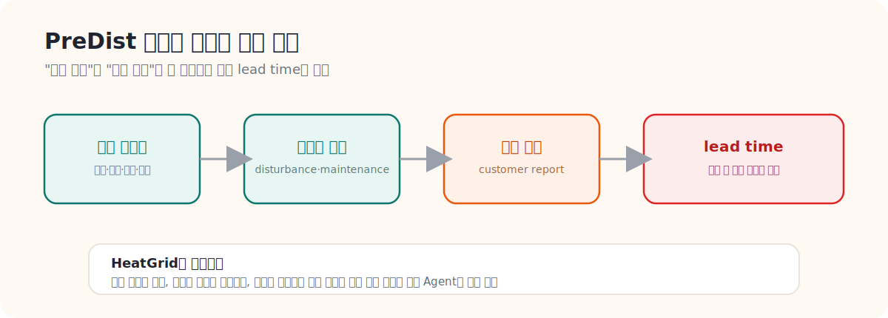

# 01. PreDist 논문 정리

> **문서 역할**  
> PreDist 논문의 문제의식과 핵심 개념을 초심자 눈높이로 설명하는 문서
> **대상 독자**  
> PreDist를 처음 읽는 사람
>
> **읽는 시간**  
> 15분
> **난이도**  
> 입문
>
> **선수지식**  
> [00_HeatGrid_Domain_Guide.md](./00_HeatGrid_Domain_Guide.md)
>
> **원문 링크**  
> [arXiv abs](https://arxiv.org/abs/2511.14791), [HTML v2](https://arxiv.org/html/2511.14791v2)
>
> **로컬 자산 경로**  
> [01_predist_paper.pdf](./assets/pdf/01_predist_paper.pdf)

---

## 한 줄 요약

PreDist는 "센서 숫자"만 모은 데이터가 아니라, **"기계가 이상해진 순간"과 "사람이 실제로 불편을 느낀 순간"을 같이 적어둔** 데이터다. 그래서 HeatGrid가 단순 고장 예측을 넘어 "민원이 터지기 전에 미리 손쓰는" 운영 도구로 갈 수 있게 해준다.

<strong>이 문서에서 자주 나오는 용어</strong>

- **PreDist**: 이 논문에서 공개한 데이터셋 이름. 지역난방 기계실의 센서 기록 + 그 기간에 있었던 사건(이상·정비·민원)을 한데 묶은 것.
- **substation(서브스테이션)**: 지역난방 열을 받아서 건물 난방·온수로 바꿔주는 사용자 측 기계실. 우리말 "기계실"과 같은 뜻.
- **disturbance(디스터번스)**: 평소 운전에서 벗어난 이상 사건. "뭔가 평소랑 다르다"가 잡힌 순간.
- **maintenance(메인터넌스)**: 사람이 실제로 가서 점검·조정·교체 같은 작업을 한 순간.
- **customer report(고객 신고)**: 사용자가 춥다/온수가 안 나온다처럼 불편을 느껴 신고한 순간.
- **lead time(리드타임)**: 이상 조짐이 처음 보인 때부터 실제 민원이나 작업으로 이어질 때까지의 시간 차. 이 시간이 길수록 미리 대응할 여유가 있다.

---

## 왜 이 논문이 중요한가

PreDist 논문은 "새 데이터셋이 나왔다"는 발표문이 아니다. 진짜 메시지는 이거다 — **지역난방에서는 센서 숫자만 봐서는 진짜 문제를 못 잡는다.** 기계가 이상해진 것과 사람이 실제로 불편해진 것은 시점도 다르고 의미도 다른데, 기존 데이터셋들은 센서 숫자만 줬다. PreDist는 그 둘을 한 시간축 위에 같이 올려서, "기계 이상 → 사람 불편"으로 번지는 과정을 데이터로 다룰 수 있게 했다.

이게 바로 HeatGrid가 가려는 방향과 거의 똑같다. 그래서 PreDist를 이해하면 HeatGrid가 왜 그렇게 설계됐는지가 자연스럽게 보인다.

## 논문이 던지는 세 가지 질문

논문을 한 꺼풀 벗기면 사실 아래 세 질문을 던지고 있다. 이 질문들이 곧 HeatGrid의 출발점이다.

<h4>센서만으로 충분한가</h4>
지역난방 기계실에서 센서 숫자만 보고 진짜 문제를 충분히 이해할 수 있을까? (논문의 답: 부족하다)

<h4>민원 전에 잡을 수 있나</h4>
고객이 "춥다"고 느끼기 전에, 미리 조짐을 포착할 수 있을까?

<h4>한 문제로 엮을 수 있나</h4>
정비가 들어간 시점과 고객이 불편을 느낀 시점을 하나의 학습 문제로 묶을 수 있을까?

## 이 데이터가 특별한 이유

핵심은 하나다. **PreDist는 센서 시계열에 "사람의 사건"을 붙였다.**

- 시계열 센서 데이터만이 아니라, 정비 기록(maintenance)과 고객 신고(customer report)를 같은 시간축에 함께 묶었다.
- 덕분에 "기계가 이상하다"와 "사람이 실제로 불편했다" 사이의 **거리**를 데이터로 측정할 수 있게 됐다.
- 이 구조 덕분에 단순 이상 탐지를 넘어, `민원 전 조기 감지`나 `정비 우선순위 정하기` 같은 진짜 운영 문제에 붙일 수 있다.

현장 운영자 입장에서 보면 더 명확하다. 고객 신고가 들어온 다음에 움직이면 이미 늦은 경우가 많다. 그래서 이 논문의 진짜 가치는 예측 정확도 숫자 자체보다, **"고객이 느끼기 전에 무엇을 포착할 수 있는가"라는 운영 질문을 데이터 구조 안에 심어놨다**는 점에 있다.

## HeatGrid로 어떻게 이어지는가

- **customer report 라벨**은 HeatGrid가 "이건 단순 기술이 아니라 진짜 운영에 도움이 된다"를 증명하는 핵심 근거가 된다.
- **disturbance와 maintenance 사이의 시간축**은 "이상 관찰 → 출동 → 조치"로 가는 흐름을 학습하는 데 쓸 수 있다.
- 그래서 HeatGrid는 "데이터로 고장 맞히는 AI"가 아니라 **"운영 기록을 읽고 판단을 돕는 Agent"**로 자리잡을 수 있다.

<strong>상황으로 이해하기</strong>
센서에서 공급온도 저하가 보이는데 아직 고객 신고는 없는 상황. HeatGrid는 이걸 "지금 당장 민원은 없지만, 곧 터질 수 있는 lead time 구간이다"라고 읽는다. 이렇게 "아직 안 터졌지만 곧 터질 수 있다"를 미리 읽는 게 바로 운영 Agent에게 필요한 사고방식이다.

## 스스로 확인하기

- PreDist가 단순 센서 데이터셋이 아니라, 운영 사건과 고객 체감까지 포함한 데이터셋이라는 걸 설명할 수 있는가?
- lead time이 왜 중요한지 한 문장으로 말할 수 있는가?
- HeatGrid가 왜 하필 이 데이터를 골랐는지 자기 말로 설명할 수 있는가?

---

## 더 깊이 보고 싶다면

- [02_PreDist_데이터셋_가이드.md](./02_PreDist_데이터셋_가이드.md) — 실제 파일 구조와 컬럼을 읽는 법
- [00_HeatGrid_Domain_Guide.md](./00_HeatGrid_Domain_Guide.md) — 전체 그림 다시 보기
