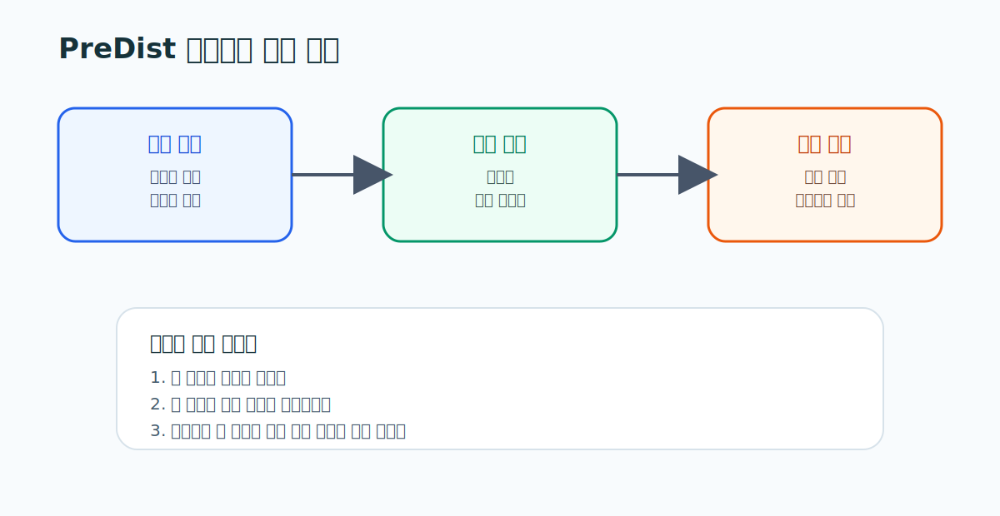

# 02. PreDist 데이터셋 가이드

> **문서 역할**  
> PreDist 파일 구조와 컬럼을 읽는 실전 가이드
> **대상 독자**  
> PreDist의 실제 데이터 구조를 처음 보는 사람
>
> **읽는 시간**  
> 20분
> **난이도**  
> 입문
>
> **선수지식**  
> [01_PreDist_논문_정리.md](./01_PreDist_논문_정리.md)
>
> **원문 링크**  
> [Zenodo](https://zenodo.org/records/17522255)
>
> **로컬 자산 경로**  
> 없음

---

## 왜 지금 이 문서를 읽는가

논문을 이해해도 실제 파일 구조와 컬럼을 읽지 못하면 모델도 Agent도 설계할 수 없다. 이 문서는 PreDist를 “파일 묶음”이 아니라 “기계실 상태와 운영 사건이 연결된 데이터 구조”로 읽게 해 준다.

## 이 문서를 읽고 나면 할 수 있는 것

- PreDist를 어떤 단위로 봐야 하는지 설명할 수 있다.
- 센서 컬럼과 이벤트 라벨을 같은 시간축 위에서 읽을 수 있다.
- HeatGrid 입력, 중간 해석, 최종 출력으로 데이터가 어떻게 흐르는지 떠올릴 수 있다.

---

## 먼저 확인할 것

- 파일이 기계실 기준으로 어떻게 나뉘는가
- 센서 시계열이 어떤 간격으로 기록되는가
- disturbance, maintenance, customer report가 어떤 방식으로 붙는가
- 하나의 이상 사건이 센서 변화와 이벤트 라벨에서 어떻게 동시에 드러나는가

## 초심자용 해석 프레임

PreDist는 아래 순서로 읽는 것이 가장 쉽다.

1. `이 파일이 어느 기계실 이야기인가`
2. `이 컬럼이 어떤 센서를 나타내는가`
3. `이 시간대에 무슨 이벤트가 붙었는가`
4. `이 패턴이 어떤 부품이나 운영 문제로 번역되는가`

## HeatGrid 관점에서 중요한 구조

- 기계실 단위
  하나의 설비가 아니라 하나의 운영 단위로 봐야 한다.
- 시계열 단위
  한 시점의 값보다 시간 흐름 속 패턴이 중요하다.
- 이벤트 라벨
  maintenance와 customer report는 운영적 의미를 붙여 준다.

## PreDist를 잘못 읽기 쉬운 지점

- 센서값만 보고 바로 고장을 확정하려는 것
- customer report를 단순 텍스트 라벨처럼 보는 것
- maintenance 이벤트를 모델 성능 검증용 라벨로만 보는 것

실제로는 customer report는 민원과 체감 품질, maintenance는 실제 작업 이력과 연결된다.

## 실무 예시

어떤 기계실에서 유량과 공급온도가 동시에 흔들리고 조금 뒤 maintenance 이벤트가 붙었다면, 현장에서는 “실제 개입이 필요했던 이상”으로 읽을 수 있다. 만약 그 사이에 customer report까지 들어왔다면 운영 영향도가 더 높았던 사건으로 볼 수 있다.

## HeatGrid에 직접 쓰는 포인트

- 입력: 기계실 단위 센서 시계열
- 해석: anomaly score, 원인 후보, 영향도
- 출력: 우선순위, 점검 순서, 작업지시, 재계획

## 매핑 표

| 데이터 요소 | HeatGrid 연결 |
|---|---|
| 기계실 ID | 멀티 사이트 운영과 권역 관리 |
| 센서 시계열 | 이상탐지, 정상 패턴 학습 |
| maintenance 이벤트 | 작업 이력과 후속 계획 |
| customer report | 민원 위험도와 체감 영향 |

## 초심자 체크포인트

- 이 데이터가 “한 기계실의 연속된 이야기”라는 점을 설명할 수 있는가
- 이벤트 라벨이 왜 Agent 설계에서 중요한지 말할 수 있는가
- 센서값에서 작업지시까지 이어지는 흐름을 머릿속에 그릴 수 있는가
