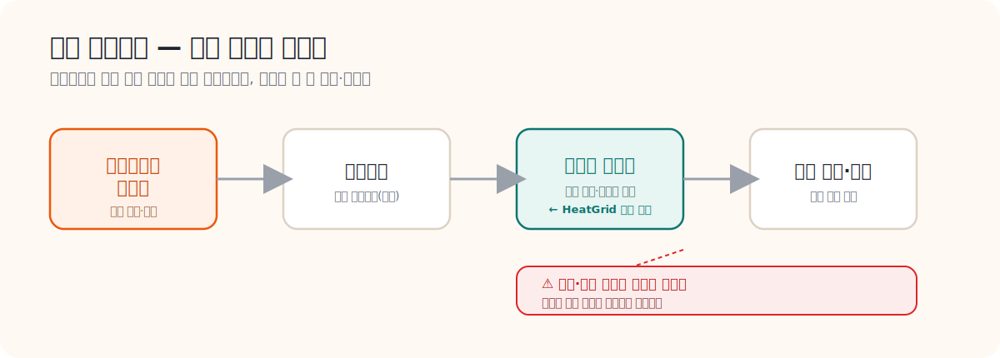

# 03. 국내 지역난방 구조와 운영 가이드

> **문서 역할**  
> 국내 구조와 운영 입문서
> **대상 독자**  
> 지역난방 기계실과 국내 운영 흐름을 처음 보는 사람
>
> **읽는 시간**  
> 25분
> **난이도**  
> 입문
>
> **선수지식**  
> 없음
>
> **원문 링크**  
> [한국지역난방공사](https://www.kdhc.co.kr/kdhc/main/main.do), [에너지공단 집단에너지 사업](https://www.energy.or.kr/front/conts/105001003005000.do)
>
> **로컬 자산 경로**  
> 없음

---

## 왜 지금 이 문서를 읽는가

HeatGrid를 지역난방 도메인에 맞게 만들려면 먼저 `국내에서 실제로 누가 열을 공급하고, 누가 민원을 받고, 누가 현장으로 출동하는지`를 알아야 한다. 이 문서는 기술 구조보다도 `국내 운영 맥락`을 잡아 주는 핵심 문서다.

## 이 문서를 읽고 나면 할 수 있는 것

- 국내 지역난방 공급 구조를 한 장 그림으로 설명할 수 있다.
- 사용자 기계실이 왜 HeatGrid의 관찰 지점인지 설명할 수 있다.
- 민원, 긴급신고, 정기점검, 협력업체 출동이 어떻게 연결되는지 말할 수 있다.

---

## 국내 지역난방의 큰 흐름

`집단에너지 사업자 -> 열수송망 -> 사용자 기계실 -> 건물 난방/급탕`

- 사업자는 열을 생산하고 공급한다.
- 열수송관은 열을 사용자 측까지 이동시킨다.
- 사용자 기계실은 열을 건물 내부 난방과 급탕으로 바꿔 전달한다.
- 실제 민원과 체감 불편은 대부분 기계실 이후 사용자 구간에서 드러난다.

## 국내 현장에서는 이렇게 움직인다

1. 사용자 또는 관리주체가 온도 저하, 급탕 불안정, 소음 같은 문제를 인지한다.
2. 운영 조직은 민원인지, 긴급신고인지, 정기점검 중 발견된 이슈인지 분류한다.
3. 원격 데이터나 기존 이력을 먼저 보고 현장 출동 필요성을 판단한다.
4. 필요 시 협력업체 또는 정비사가 출동해 기계실 설비를 점검한다.
5. 작업 후 조치 결과와 재발 가능성을 기록한다.

---

## 국내 운영에서 중요한 설비

- 열교환기
- 순환펌프
- 제어밸브와 액추에이터
- 스트레이너와 필터
- 온도, 압력, 유량 센서
- 제어반과 로컬 제어기

국내에서는 설비 그 자체만이 아니라 `민원 대응`, `긴급출동`, `지원사업`, `안전 점검`이 함께 운영의 일부로 묶인다.

## 운영 흐름과 HeatGrid 개입 지점

| 단계 | 국내 운영에서 실제로 일어나는 일 | HeatGrid가 개입할 수 있는 지점 |
|---|---|---|
| 이상 감지 | 민원, 정기점검, 원격 데이터에서 이상이 보임 | 센서 이탈 탐지, 민원 리스크 알림 |
| 1차 판단 | 출동 필요성, 긴급성, 영향도를 판단 | 우선순위 추천, 영향도 설명 |
| 현장 출동 | 정비사 또는 협력업체가 기계실 점검 | 점검 순서와 준비물 제안 |
| 조치 수행 | 세척, 교체, 재설정, 추가 점검 수행 | 작업지시서와 체크리스트 제공 |
| 기록과 후속 관리 | 결과 기록, 재발 확인, 재출동 여부 판단 | 이력 축적, 재계획 추천 |

---

## 상황 예시

### 공급온도 저하 + 유량 흔들림

- 현장에서는 먼저 `열원 문제`보다 `펌프 이상`, `스트레이너 막힘`, `제어밸브 반응 불량`을 함께 의심한다.
- 공급온도만 떨어진다면 제어값 문제일 수도 있지만, 유량까지 흔들리면 순환 계통을 같이 봐야 한다.
- 이때 좋은 Agent는 “온도가 낮다”가 아니라 “공급온도 저하와 유량 불안정이 동시 발생했으니 순환펌프와 스트레이너를 먼저 점검하라”고 말해야 한다.

## HeatGrid 시사점

- 국내에서는 단순한 고장 분류보다 `민원 전에 무엇을 먼저 볼 것인가`가 더 중요하다.
- 운영자는 직접 정비하지 않는 경우가 많아서, 어떤 협력업체를 어떤 우선순위로 보내야 하는지가 중요하다.
- 따라서 HeatGrid는 `운영 판단을 돕는 Agent`라는 설명이 국내 맥락에 잘 맞는다.

## 다음에 읽을 문서

- [04_해외_지역난방_구조와_운영_가이드.md](./04_해외_지역난방_구조와_운영_가이드.md)
- [12_정비사_업무와_출동_프로세스_가이드.md](./12_정비사_업무와_출동_프로세스_가이드.md)
