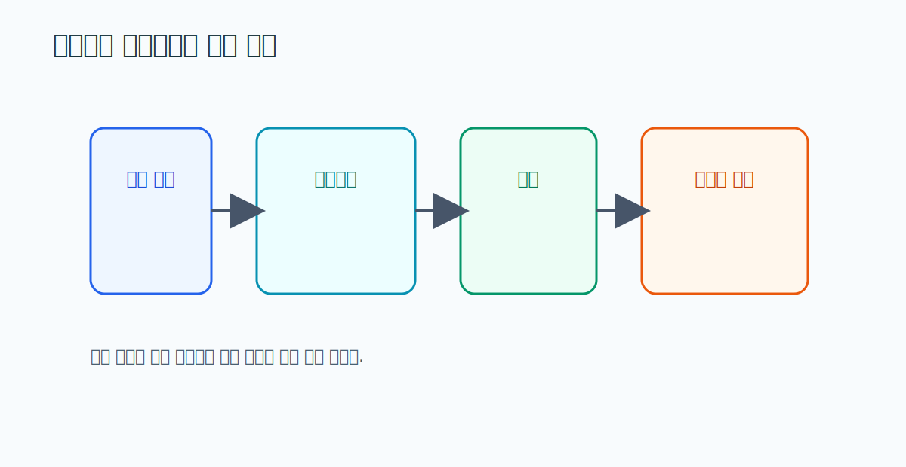

# 05. District Heating Substations Design 요약

> **문서 역할**  
> 기계실 설계와 시스템 구조를 이해하는 문서
> **대상 독자**  
> 기계실을 구성요소와 흐름 관점에서 처음 배우는 사람
>
> **읽는 시간**  
> 18분
> **난이도**  
> 입문
>
> **선수지식**  
> [04_해외_지역난방_구조와_운영_가이드.md](./04_해외_지역난방_구조와_운영_가이드.md)
>
> **원문 링크**  
> [District Heating Substations Design PDF](https://www.energiforetagen.se/4a4e6b/globalassets/energiforetagen/det-erbjuder-vi/publikationer/f101-district-heating-substations-design-and-installation.pdf)
>
> **로컬 자산 경로**  
> [05_substation_design.pdf](./assets/pdf/05_substation_design.pdf)

---

## 한 줄 요약

기계실은 부품을 모아둔 창고가 아니라, **부품들이 서로 영향을 주고받는 하나의 시스템**이다. 펌프가 약해지면 유량이 떨어지고, 유량이 떨어지면 온도차가 흔들린다. 그래서 한 센서가 이상하다고 그 부품만 보면 안 되고, "어느 계통이 흔들리는가"를 봐야 한다.

<strong>이 문서에서 자주 나오는 용어</strong>

- **열교환기**: 사업자가 보낸 뜨거운 물의 열을, 건물 안 물로 옮겨주는 장치. 두 물은 섞이지 않고 열만 건너간다.
- **순환펌프**: 건물 난방수를 계속 돌게 밀어주는 펌프. 사람의 심장에 해당.
- **(제어)밸브**: 물이 얼마나 흐를지 조절하는 수도꼭지 같은 부품.
- **계측기**: 온도·압력·유량 등을 재는 측정 장비(센서를 포함하는 더 넓은 말).
- **차압**: 어떤 지점과 다른 지점의 압력 차. 갑자기 커지면 "어딘가 막혔다" 신호.
- **온도차**: 들어온 물과 나가는 물의 온도 차이. 열교환이 잘 되는지를 보여준다.
- **계통(system loop)**: 서로 연결돼 함께 움직이는 부품 묶음(예: 순환 계통 = 펌프+밸브+배관).
- **예방정비 / 상태기반 정비 / 사후정비**: 각각 "고장 전에 미리", "상태 나빠지면", "고장 난 뒤에" 정비하는 세 가지 방식.

---

## 왜 이 문서를 읽는가

이 문서는 기계실을 **"부품 목록"이 아니라 "연결된 하나의 시스템"**으로 보게 만든다. HeatGrid가 센서, 부품, 고장을 자연스럽게 이어 붙이려면 바로 이 관점이 필요하다. 부품을 하나씩 외우는 게 목표가 아니라, "이것들이 어떻게 서로 엮여 있는가"를 느끼는 게 목표다.

## 기계실은 이렇게 연결돼 있다

물의 여정을 따라가면 부품들이 어떻게 이어지는지 한 번에 보인다.

1. 사업자가 보낸 뜨거운 물이 **열교환기**에 도착한다.
2. 열교환기가 그 열을 건물 안 물로 넘긴다.
3. **순환펌프**가 데워진 건물 물을 각 세대로 밀어 보낸다.
4. **제어밸브**가 흐름을 조절해 적정 온도를 맞춘다.
5. 곳곳의 **센서·계측기**가 온도·압력·유량을 잰다.

핵심은, 이 다섯이 **사슬처럼 연결**돼 있다는 점이다. 펌프가 약해지면 → 유량이 떨어지고 → 열교환 효율이 흔들리고 → 공급온도가 내려간다. 한 군데가 흔들리면 옆으로 번진다.

## 정비 방식 세 가지

설비 구조를 알아야 "어떤 정비가 맞는지"도 제대로 구분된다.

<h4>예방정비</h4>
고장 나기 전에 정해진 주기로 미리 점검·정비. (예: 6개월마다 필터 청소)

<h4>상태기반 정비</h4>
주기와 상관없이, 상태가 나빠진 게 보이면 정비. (예: 차압이 평소보다 커지면 점검)

<h4>사후정비</h4>
실제로 고장 난 뒤에 고치는 것. 가장 비용이 크고 민원도 동반하기 쉽다.

HeatGrid가 지향하는 건 사후정비를 줄이고, 예방·상태기반 정비를 잘 추천하는 것이다.

## 상황으로 이해하기: 유량 저하

<strong>"펌프만 보지 않는다"</strong>
유량이 떨어졌다고 펌프 하나만 의심하면 오진하기 쉽다. 현장에서는 필터 막힘, 열교환기 상태, 밸브 반응, 차압 변화를 <strong>같이</strong> 보면서 시스템 전체를 의심한다. 유량 저하는 "순환 계통 어딘가가 막히거나 약해졌다"는 증상이지, 특정 부품의 확정 진단이 아니기 때문이다.

### PreDist와 연결하면

PreDist에서 유량과 온도차가 같이 흔들리는 패턴이 보이면, 단일 센서 이상으로 처리하기보다 **순환 계통 문제나 열교환 효율 저하**를 원인 후보로 먼저 올리는 식으로 연결할 수 있다.

## HeatGrid에 적용하기

- Agent는 "부품 하나가 고장났다"가 아니라 **"연결 구조상 어떤 계통이 흔들린다"**고 설명해야 한다.
- 센서와 부품을 1대1로 딱 묶기보다, **계통 단위의 관계**를 함께 보여줘야 한다.

## 스스로 확인하기

- 기계실을 단일 부품이 아니라 시스템으로 설명할 수 있는가?
- 예방정비와 사후정비의 차이를 말할 수 있는가?
- 센서 이상을 설비 구조와 연결해 해석할 수 있는가?

---

## 더 깊이 보고 싶다면

- [06_Gebwell_OandM_요약.md](./06_Gebwell_OandM_요약.md) — 그 시스템을 실제로 점검하는 순서
- [00_HeatGrid_Domain_Guide.md](./00_HeatGrid_Domain_Guide.md) — 센서·고장 한눈에 보기
