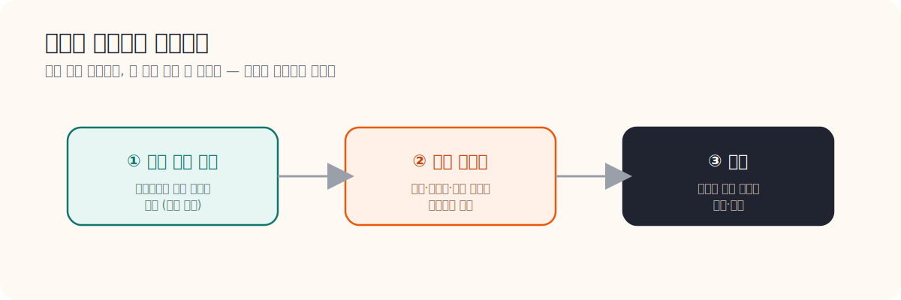

# 06. Gebwell O&M 요약

> **문서 역할**  
> 현장 운전과 유지관리 흐름을 읽는 문서
> **대상 독자**  
> 실제 점검과 운전 순서를 알고 싶은 사람
>
> **읽는 시간**  
> 18분
> **난이도**  
> 입문
>
> **선수지식**  
> [05_District_Heating_Substations_Design_요약.md](./05_District_Heating_Substations_Design_요약.md)
>
> **원문 링크**  
> [Gebwell O&M PDF](https://gebwell.fi/app/uploads/2021/09/Installation-operation-and-maintenance-manual-v2-0-07022019-EN-PRINT.pdf)
>
> **로컬 자산 경로**  
> [06_gebwell_oandm_manual.pdf](./assets/pdf/06_gebwell_oandm_manual.pdf)

---

## 한 줄 요약

좋은 점검은 **"무엇을 볼까"보다 "어떤 순서로 볼까"**가 핵심이다. 의사가 배 아프다고 바로 배를 가르지 않고 문진 → 촉진 → 검사 순으로 좁혀가듯, 기계실 점검도 운전 상태 확인 → 원인 좁히기 → 조치 순서를 따른다. 그리고 그 순서를 알려면 "정상이 어떤 모습인지"를 먼저 알아야 한다.

<strong>이 문서에서 자주 나오는 용어</strong>

- **O&M (Operation & Maintenance)**: 운전(매일 돌리기)과 유지관리(점검·정비)를 합쳐 부르는 말.
- **운전 상태**: 지금 설비가 정상적으로 돌고 있는 모습. 온도·압력·유량이 정상 범위인지.
- **정상 기준값**: "이 정도면 정상"이라고 정해둔 값의 범위. 이상 판단의 출발점.
- **차압 / 온도차**: (5장 참고) 각각 압력 차이와 입·출수 온도 차이. 막힘·효율 저하를 보여주는 핵심 신호.
- **오진**: 원인을 잘못 짚는 것. 순서 없이 점검하면 오진 가능성이 커진다.

---

## 왜 이 문서를 읽는가

5장에서 기계실의 **구조**를 배웠다면, 이제는 그걸 실제로 **어떤 순서로 확인하고 점검하는지**를 알아야 한다. 이 문서는 HeatGrid의 작업지시서가 어떤 문장과 순서를 가져야 하는지를 보여준다.

## 점검의 기본 원칙

<h4>한 흐름으로 본다</h4>
매뉴얼은 설치 → 운전 → 점검 → 안전을 따로따로가 아니라 하나의 흐름으로 다룬다.

<h4>정상을 먼저 안다</h4>
이상을 판단하려면 "정상이 어떤 모습인지"를 먼저 알아야 한다. 기준이 없으면 이상도 못 잡는다.

<h4>순서대로 좁힌다</h4>
무작정 분해하지 않는다. 운전 상태 확인 → 원인 좁히기 → 조치 순서를 지킨다.

## 상황으로 이해하기: 열교환기 문제 의심

<strong>왜 순서가 중요한가</strong>
열교환기가 의심된다고 바로 뜯어보면 안 된다. 먼저 운전 상태 → 차압 → 온도차 → 밸브 반응을 <strong>순서대로</strong> 확인한다. 이 순서가 없으면 시간도 많이 쓰고, 멀쩡한 부품을 건드려 오진할 가능성도 커진다. 순서는 "쉽고 빠르게 확인되는 것부터, 손이 많이 가는 것 순으로" 짜는 게 원칙이다.

이 순서가 중요한 이유는 분명하다. 운전 상태와 차압은 분해 없이 계기판으로 바로 확인된다. 거기서 이미 원인이 좁혀지면, 굳이 열교환기를 뜯지 않아도 된다. 가장 비용이 적게 드는 확인부터 하는 것이다.

### PreDist와 연결하면

공급온도 저하와 환수온도 이상이 함께 나타나면, HeatGrid는 **"열교환 효율 저하 의심 — 차압과 온도차를 먼저 확인하라"**처럼, 단순 경보가 아니라 **점검 순서가 들어간 작업지시**를 만들 수 있다.

## HeatGrid에 적용하기

- 작업지시서에는 반드시 **점검 순서**가 들어가야 한다.
- **정상 기준값과 안전 주의사항**을 같이 붙여야 정비사가 바로 판단할 수 있다.
- "모델이 맞았는지"보다 **"정비사가 바로 움직일 수 있는지"**가 더 중요하다.

## 스스로 확인하기

- 좋은 작업지시서가 왜 점검 순서를 가져야 하는지 설명할 수 있는가?
- 정상 운전 기준이 왜 먼저 필요한지 이해했는가?
- 센서 이벤트를 실제 점검 항목으로 바꿀 수 있는가?

---

## 더 깊이 보고 싶다면

- [08_District_Energy_PM_Checklist_요약.md](./08_District_Energy_PM_Checklist_요약.md) — 점검 순서를 체크리스트로 구조화
- [12_정비사_업무와_출동_프로세스_가이드.md](./12_정비사_업무와_출동_프로세스_가이드.md) — 정비사의 실제 출동 흐름
