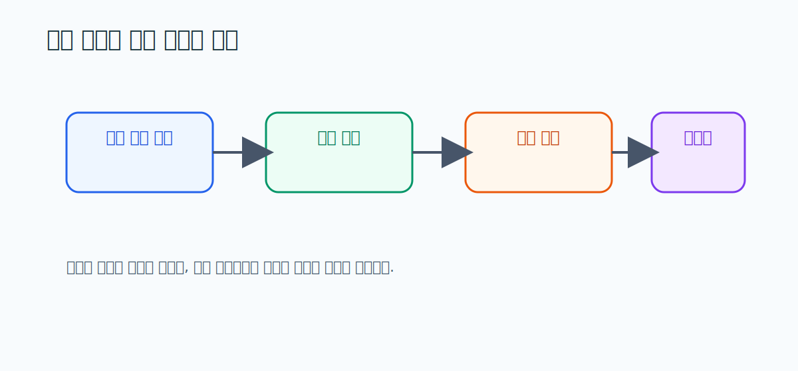

# 07. IEA DHC Connection Handbook 요약

> **문서 역할**  
> 연결 구조와 운영 기록 문화를 이해하는 문서
> **대상 독자**  
> 설비 연결과 점검 이력이 왜 중요한지 알고 싶은 사람
>
> **읽는 시간**  
> 18분
> **난이도**  
> 입문 ~ 중급
>
> **선수지식**  
> [04_해외_지역난방_구조와_운영_가이드.md](./04_해외_지역난방_구조와_운영_가이드.md)
>
> **원문 링크**  
> [IEA DHC Handbook](https://www.iea-dhc.org/fileadmin/documents/Annex_VI/DHC_Connection_Handbook.pdf)
>
> **로컬 자산 경로**  
> [07_iea_dhc_connection_handbook.pdf](./assets/pdf/07_iea_dhc_connection_handbook.pdf)

---

## 한 줄 요약

같은 고장이라도 **"과거에 이 설비에 무슨 일이 있었는지"**를 알면 판단이 달라진다. 지난달 갈았는데 또 고장 난 밸브와, 5년 만에 처음 이상이 생긴 밸브는 똑같은 "밸브 이상"이어도 대응이 달라야 한다. 그래서 기록(로그북)은 단순 보관용이 아니라, 다음 판단을 위한 입력이다.

<strong>이 문서에서 자주 나오는 용어</strong>

- **연결 구조**: 사업자 배관과 건물 설비가 어떻게 이어지는지의 구조. 안정 운영의 뼈대.
- **로그북(logbook)**: 점검·정비 내용을 날짜별로 적어두는 작업 일지.
- **정비 이력(maintenance history)**: 그 설비에 지금까지 어떤 작업이 있었는지의 누적 기록.
- **재발 설비**: 같은 고장이 반복해서 나는 설비. 따로 관리할 가치가 있다.
- **책임 구분**: 어디까지를 사업자가, 어디부터를 사용자/관리주체가 책임지는지의 경계.
- **재계획(replan)**: 상황이 바뀌었을 때 우선순위와 일정을 다시 짜는 것.

---

## 왜 이 문서를 읽는가

HeatGrid는 단순한 경보기가 아니라, **연결 구조와 점검 이력을 활용해 다음 대응을 더 잘 짜는 Agent**에 가깝다. 이 문서는 "기록이 왜 재계획의 입력이 되는가"를 이해하게 해준다. 경보는 "지금 이상하다"만 말하지만, 기록이 더해지면 "이건 처음이 아니다, 이번엔 다르게 대응하자"까지 말할 수 있다.

## 핵심 원칙 세 가지

<h4>연결 구조 = 뼈대</h4>
설비가 어떻게 이어져 있는지가 안정 운영의 기본 골격이다. 구조를 알아야 어디서 문제가 번지는지 보인다.

<h4>기록 = 다음 판단의 입력</h4>
로그북은 그냥 보관하는 서류가 아니다. 다음 점검과 후속 계획을 짤 때 쓰는 입력 데이터다.

<h4>책임·기록 문화 = 품질</h4>
누가 무엇을 책임지는지가 명확하고, 기록을 꼬박꼬박 남기는 문화가 유지관리 품질을 끌어올린다.

## 상황으로 이해하기: 같은 밸브 이상, 다른 판단

<strong>기록이 우선순위를 바꾼다</strong>
A 밸브와 B 밸브에 똑같이 "이상" 신호가 떴다. 그런데 A는 최근에 교체했는데 또 문제가 생긴 데다 같은 고장이 반복된 이력이 있다. B는 오랫동안 멀쩡했던 설비다. 이 경우 A의 출동 우선순위를 더 높이는 게 맞다. <strong>기록이 있어야 같은 고장을 다르게 판단</strong>할 수 있다.

### PreDist와 연결하면

PreDist의 maintenance 이벤트는 단순한 정답 꼬리표가 아니다. **"과거에 실제로 사람이 개입했던 설비"**를 알려주는 운영 기록으로 읽어야 한다. 그렇게 보면 같은 센서 이상도 "이 설비는 손이 자주 갔던 곳"이라는 맥락과 함께 해석된다.

## HeatGrid에 적용하기

- **이력 기반으로 우선순위를 조정**해야 한다. 같은 이상도 재발 이력이 있으면 더 위로.
- **재발 설비는 재계획 루프에서 가중치를 높일** 수 있다.
- 설명 가능한 작업지시서에는 **과거 이력 요약**을 붙이는 편이 좋다. ("이 설비, 3개월 새 2번째 출동입니다"처럼.)

## 스스로 확인하기

- 운영 기록이 왜 예측 성능만큼 중요한지 설명할 수 있는가?
- maintenance 이벤트를 "작업 이력"으로 해석하고 있는가?
- HeatGrid가 왜 기록 구조를 가져야 하는지 이해했는가?

---

## 더 깊이 보고 싶다면

- [09_ASHRAE_180_요약.md](./09_ASHRAE_180_요약.md) — 기록을 담는 유지관리 계획 문서의 뼈대
- [10_Anomaly_Detection_Review_요약.md](./10_Anomaly_Detection_Review_요약.md) — 이력과 이상탐지를 함께 보기
