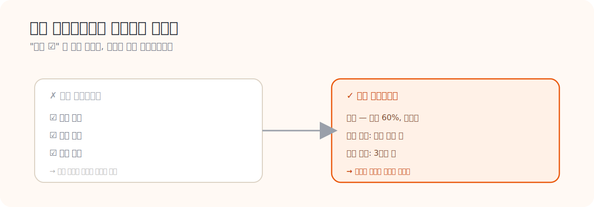

# 08. District Energy PM Checklist 요약

> **문서 역할**  
> 예방정비 체크리스트를 운영 문서로 읽는 문서
> **대상 독자**  
> 체크리스트를 HeatGrid 작업지시서에 녹이고 싶은 사람
>
> **읽는 시간**  
> 15분
> **난이도**  
> 입문
>
> **선수지식**  
> [06_Gebwell_OandM_요약.md](./06_Gebwell_OandM_요약.md)
>
> **원문 링크**  
> [Checklist PDF](https://districtenergy.org/HigherLogic/System/DownloadDocumentFile.ashx?DocumentFileKey=7f51c5dd-0f5d-6d4f-bc82-3a3f8d5f3551)
>
> **로컬 자산 경로**  
> [08_district_energy_pm_checklist.pdf](./assets/pdf/08_district_energy_pm_checklist.pdf)

---

## 한 줄 요약

정비사의 일은 결국 **체크리스트**로 떨어진다. 그런데 좋은 체크리스트는 "확인 ☑" 한 칸이 아니라, **무엇을 어떻게 보고 결과를 어떻게 남길지**까지 들어 있어야 한다. 비행기 조종사가 이륙 전 항목을 하나씩 짚어 누락을 막듯, 정비 체크리스트도 작업 품질을 표준화하고 빠뜨림을 줄인다.

<strong>이 문서에서 자주 나오는 용어</strong>

- **PM (Preventive Maintenance, 예방정비)**: 고장 전에 미리 도는 정기 점검·정비.
- **체크리스트**: 점검할 항목을 빠짐없이 적어 하나씩 확인하게 만든 목록.
- **주기**: 얼마마다 점검하는지(예: 월 1회, 분기 1회).
- **스트레이너**: 물속 찌꺼기를 거르는 거름망. 막히면 유량이 떨어진다.
- **결과 기록**: 점검하고 끝이 아니라, 오염 정도·조치 여부·다음 점검 시점을 적어 남기는 것.

---

## 왜 이 문서를 읽는가

HeatGrid가 "좋은 작업지시서"를 만들려면, 정비사가 실제로 쓰는 **체크리스트의 구조**를 알아야 한다. 이 문서는 어떤 체크 항목을 어떻게 구조화해야 현장에서 바로 쓸 수 있는지를 보여준다.

## 좋은 체크리스트의 조건

<h4>주기와 항목이 명확</h4>
"언제, 무엇을" 점검하는지가 분명해야 한다. 애매하면 사람마다 다르게 한다.

<h4>품질을 표준화</h4>
누가 하든 같은 수준으로 점검되게 만들고, 빠뜨림을 줄인다.

<h4>"확인"을 넘어선다</h4>
☑ 한 칸이 아니라, 구체적으로 무엇을 했고 결과가 어땠는지까지 기록하게 한다.

## 상황으로 이해하기: 필터 점검

<strong>"확인했음"으로 끝내지 않는다</strong>
필터 점검은 단순히 "봤다"로 끝나면 안 된다. <strong>오염 정도가 어땠는지, 세척이 필요했는지, 교체가 필요했는지, 다음 점검은 언제로 잡을지</strong>를 같이 남겨야 한다. 그래야 다음 사람이 "지난번엔 절반쯤 막혔었구나, 이번엔 더 심해졌네"라고 비교하며 판단할 수 있다. 기록이 비교를 만들고, 비교가 예측을 만든다.

### PreDist와 연결하면

유량 저하 패턴이 반복적으로 보이면, HeatGrid는 체크리스트에서 **스트레이너·필터·차압 항목을 자동으로 맨 위에 배치**하는 식으로 연결할 수 있다. 데이터가 "이번엔 여기부터 보라"고 체크리스트 순서를 바꿔주는 것이다.

## HeatGrid에 적용하기

- 작업지시서에 **점검 체크 항목을 구조화**해 넣어야 한다.
- 센서 패턴에 따라 **체크리스트 순서를 바꾸는** 기능이 유용하다.
- 출동 후 **결과 입력도 체크리스트 형식**으로 남겨야, 다음 재계획에 쓸 수 있다.

## 스스로 확인하기

- 체크리스트가 왜 단순 부속 문서가 아닌지 설명할 수 있는가?
- 센서 이상을 구체적인 점검 항목으로 바꿀 수 있는가?
- 예방정비 품질이 왜 "작업 표준화"에 달렸는지 이해했는가?

---

## 더 깊이 보고 싶다면

- [09_ASHRAE_180_요약.md](./09_ASHRAE_180_요약.md) — 체크리스트를 담는 유지관리 계획 표준
- [12_정비사_업무와_출동_프로세스_가이드.md](./12_정비사_업무와_출동_프로세스_가이드.md) — 체크리스트를 쓰는 정비사의 하루
