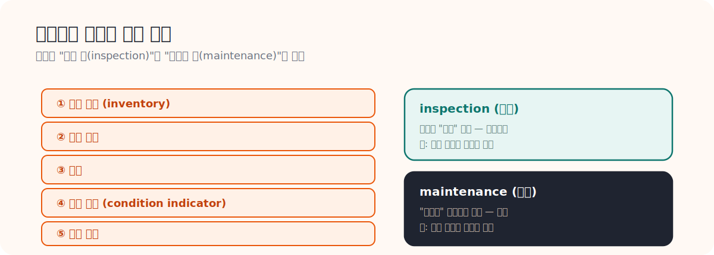

# 09. ASHRAE 180 요약

> **문서 역할**  
> 유지관리 계획 표준을 운영 문서 관점에서 읽는 문서
> **대상 독자**  
> maintenance plan 구조를 이해하고 싶은 사람
>
> **읽는 시간**  
> 18분
> **난이도**  
> 중급
>
> **선수지식**  
> [08_District_Energy_PM_Checklist_요약.md](./08_District_Energy_PM_Checklist_요약.md)
>
> **원문 링크**  
> [ASHRAE Preview PDF](https://www.ashrae.org/File%20Library/Technical%20Resources/Bookstore/previews_2016639_pre.pdf)
>
> **로컬 자산 경로**  
> [09_ashrae_180_preview.pdf](./assets/pdf/09_ashrae_180_preview.pdf)

---

## 왜 읽어야 하는가

HeatGrid가 진짜 운영 Agent가 되려면 단순 경보가 아니라 계획 문서와 작업 오더 수준의 출력을 만들 수 있어야 한다. ASHRAE 180은 그 계획 문서가 어떤 뼈대를 가져야 하는지 보여 준다.

## 이 문서를 읽고 나면 할 수 있는 것

- inspection과 maintenance를 구분할 수 있다.
- condition indicator가 왜 중요한지 설명할 수 있다.
- HeatGrid 출력이 왜 계획 문서에 가까워야 하는지 이해할 수 있다.

## 핵심 개념

- 유지관리 계획에는 설비 inventory, 점검 항목, 일정, 상태 지표, 결과 기록이 들어간다.
- inspection은 상태를 관찰하는 행위다.
- maintenance는 실제 조치까지 포함하는 더 넓은 개념이다.

## 실무 예시

같은 온도 이상이라도 condition indicator가 이미 나빠진 설비라면 단순 관찰보다 우선 출동 대상으로 올릴 수 있다. 이 차이가 바로 운영 판단이다.

## PreDist 연결 예시

PreDist에서 반복 이상 패턴을 condition indicator 후보로 삼으면, 설비를 “관찰 필요”와 “즉시 조치 필요” 단계로 나누는 기준을 세울 수 있다.

## HeatGrid 적용 포인트

- 작업 오더에는 설비 ID, 점검 항목, 상태 지표, 기록 형식이 함께 있어야 한다.
- 단순 경보보다 운영 계획 문서에 가까운 출력이 필요하다.
- 향후에는 설비별 condition indicator 라이브러리를 따로 둘 수 있다.

## 초심자 체크포인트

- inspection과 maintenance 차이를 설명할 수 있는가
- condition indicator가 왜 중요한지 말할 수 있는가
- HeatGrid 출력이 왜 계획 문서에 가까워야 하는지 이해했는가
