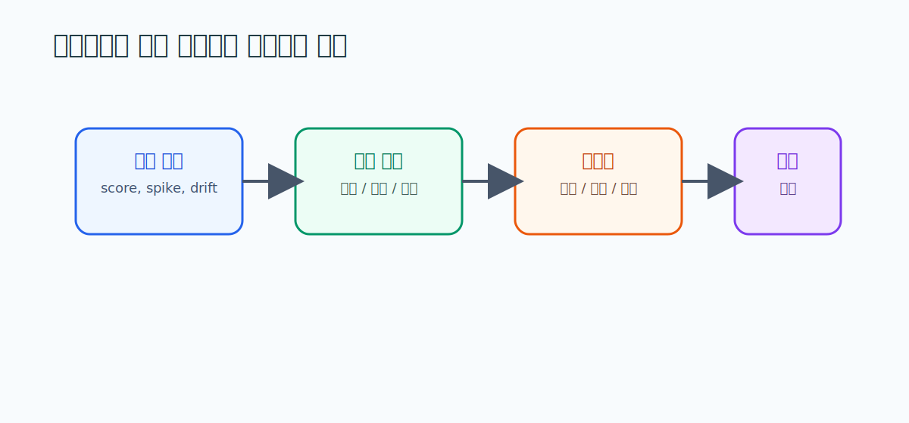

# 10. Anomaly Detection Review 요약

> **문서 역할**  
> 이상탐지를 현장 운영 언어로 번역하는 문서
> **대상 독자**  
> 이상 점수(anomaly score)를 HeatGrid 문제로 연결하려는 사람
>
> **읽는 시간**  
> 18분
> **난이도**  
> 입문 ~ 중급
>
> **선수지식**  
> [02_PreDist_데이터셋_가이드.md](./02_PreDist_데이터셋_가이드.md)
>
> **원문 링크**  
> [Thesis PDF](https://lup.lub.lu.se/student-papers/record/9147924/file/9147925.pdf)
>
> **로컬 자산 경로**  
> [10_ml_anomaly_detection_thesis.pdf](./assets/pdf/10_ml_anomaly_detection_thesis.pdf)

---

## 한 줄 요약

이상탐지는 HeatGrid의 **전부가 아니라 일부**다. 모델이 "이상하다"고 외친다고 다 중요한 건 아니다. 센서가 잠깐 튄 것일 수도, 진짜 민원의 전조일 수도 있다. 그래서 이상 점수를 그대로 쓰지 않고, **현장 맥락·영향도·원인 후보와 함께 번역**하는 단계가 꼭 필요하다.

<strong>이 문서에서 자주 나오는 용어</strong>

- **이상탐지(anomaly detection)**: 평소 패턴과 다른 신호를 자동으로 찾아내는 기술.
- **이상 점수(anomaly score)**: 지금 값이 평소와 얼마나 다른지를 숫자로 나타낸 것.
- **센서 스파이크**: 센서값이 순간적으로 확 튀는 것. 실제 고장이 아니라 센서 오류일 때가 많다.
- **설비 열화**: 설비가 시간이 지나며 서서히 성능이 떨어지는 것. 천천히 진행돼 놓치기 쉽다.
- **설명 가능성(explainability)**: AI가 "왜 그렇게 판단했는지"를 사람이 이해할 수 있게 보여주는 것.
- **후처리 계층**: 모델이 낸 이상 점수를 운영 판단으로 다듬는 중간 단계.

---

## 왜 이 문서를 읽는가

이상탐지는 HeatGrid의 한 부품일 뿐, 전부가 아니다. 이 문서는 **어떤 이상이 진짜 의미 있고, 어떤 이상은 현장 맥락이 없으면 가치가 떨어지는지**를 구분하게 도와준다. 이걸 모르면 "이상 점수가 높다"는 이유만으로 엉뚱한 곳에 정비사를 보내게 된다.

## 핵심 원칙 세 가지

<h4>정상을 먼저 안다</h4>
이상을 찾으려면 정상 패턴을 잘 알아야 한다. 기준이 흐릿하면 이상도 흐릿하다.

<h4>이상의 무게는 다르다</h4>
센서 스파이크, 설비 열화, 제어 불안정 — 다 "이상"이지만 운영 중요도는 제각각이다.

<h4>설명·적용이 성능만큼 중요</h4>
모델이 정확한 것보다, 그 판단을 현장이 이해하고 바로 쓸 수 있는지가 똑같이 중요하다.

## 상황으로 이해하기: 큰 이상 vs 작은 이상

<strong>점수가 크다고 중요한 게 아니다</strong>
센서 스파이크는 모델 눈에는 "큰 이상"으로 보인다. 하지만 운영 입장에서는 그냥 센서 교정이 필요한 문제일 수 있다 — 설비는 멀쩡하다. 반대로, 작은 온도 이탈이 <strong>반복</strong>되면 점수는 낮아도 실제 민원의 전조일 수 있다. 점수의 크기가 아니라 "이게 현장에서 무슨 의미인가"가 진짜 중요하다.

### PreDist와 연결하면

PreDist에서 **disturbance와 customer report가 같이 붙는 패턴**은, 단순한 수치 이상보다 운영적으로 훨씬 중요한 학습 사례가 된다. "이상이 떴고 + 실제로 사람이 불편했다"가 한 묶음이기 때문이다. 이런 사례를 골라 학습하면 "진짜 중요한 이상"을 더 잘 잡는다.

## HeatGrid에 적용하기

- 이상 점수만으로는 부족하다. **원인 후보와 영향도를 함께** 해석해야 한다.
- **센서 이상과 설비 이상을 구분하는 후처리 계층**이 필요하다.
- 리드타임 예측이 있더라도, **우선순위화와 재계획은 따로** 있어야 한다.

이것이 00장에서 말한 "HeatGrid = 이상탐지 모델이 아니라 운영 시스템"의 핵심 근거다. 이상탐지는 다리의 한쪽 끝일 뿐, 반대편 끝(작업지시)까지 이어줘야 가치가 생긴다.

## 스스로 확인하기

- 정상 패턴을 왜 먼저 알아야 하는지 설명할 수 있는가?
- 센서 이상과 설비 이상을 같은 경보로 다루면 안 되는 이유를 말할 수 있는가?
- HeatGrid에서 이상탐지가 왜 "보조 계층"인지 이해했는가?

---

## 더 깊이 보고 싶다면

- [00_HeatGrid_Domain_Guide.md](./00_HeatGrid_Domain_Guide.md) — 8·10절 우선순위화와 Agent 계층
- [09_ASHRAE_180_요약.md](./09_ASHRAE_180_요약.md) — 이상 패턴을 상태 지표로 다루기
