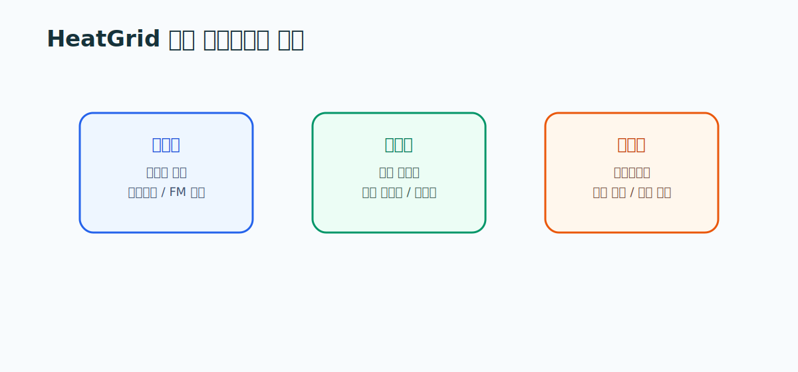

# 11. 국내 정책, 시장, 사업자 가이드

> **문서 역할**  
> 국내 출시와 시장 이해를 위한 가이드
> **대상 독자**  
> HeatGrid의 고객과 사용자, 도입 논리를 정리하려는 사람
>
> **읽는 시간**  
> 15분
> **난이도**  
> 입문
>
> **선수지식**  
> [03_국내_지역난방_구조와_운영_가이드.md](./03_국내_지역난방_구조와_운영_가이드.md)
>
> **원문 링크**  
> [한국지역난방공사 AX 로드맵](https://www.kdhc.co.kr/kdhc/bbs/B0000038/view.do?menuNo=200125&nttId=6448&pageIndex=1), [에너지공단 집단에너지 사업](https://www.energy.or.kr/front/conts/105001003005000.do)
>
> **로컬 자산 경로**  
> 없음

---

## 한 줄 요약

아무리 기술이 좋아도, **돈 내는 사람과 실제 쓰는 사람이 다르면** 메시지도 달라야 한다. 지역난방에서는 사업자 본사(구매자), 현장 운영자·정비사(사용자), 관리사무소·입주자(영향자)가 각자 다른 걸 본다. HeatGrid가 누구에게 무엇을 보여줄지 정리하는 게 이 문서의 목표다.

<strong>이 문서에서 자주 나오는 용어</strong>

- **집단에너지 사업자**: 열을 대량 생산·공급하는 회사. 한국지역난방공사, GS파워, 대성에너지 등.
- **FM(Facility Management) 조직**: 설비 운영·관리를 전문으로 대행하는 조직/회사.
- **관제 담당자**: 여러 현장을 원격으로 모니터링하며 상황을 판단하는 사람.
- **구매자 / 사용자 / 영향자**: 각각 돈을 내는 쪽, 실제로 쓰는 쪽, 도입 분위기에 영향을 주는 쪽.
- **재출동**: 한 번 갔는데 또 가야 하는 상황. 비용·민원으로 직결돼 줄이는 게 중요하다.
- **권역**: 한 사업자가 책임지는 지역 범위.

---

## 왜 이 문서를 읽는가

좋은 기술 문서만으로는 서비스가 되지 않는다. **누가 구매하고, 누가 사용하고, 누가 도입을 막거나 밀어주는지**를 알아야 HeatGrid의 초기 고객과 메시지가 선명해진다.

## 국내 시장, 큰 그림

- 국내 집단에너지 시장은 **공공과 민간 사업자가 함께** 운영한다.
- 지역난방 사업자, FM 조직, 관리사무소, 협력 정비업체가 **각자 다른 역할**을 맡는다.
- 정책 방향도 AI, 효율화, 스마트 유지관리, 디지털 전환과 맞물려 있어 HeatGrid가 들어갈 자리가 있다.

## 세 부류의 사람을 구분하라

이게 이 문서의 핵심이다. 같은 HeatGrid라도 누구에게 말하느냐에 따라 강조점이 달라진다.

<h4>구매자</h4>
사업자 본사·운영본부·FM 본부. <strong>예산과 도입을 결정</strong>한다. 관심사: 민원 감소, 운영 효율, 재출동 감소.

<h4>사용자</h4>
관제 담당자·설비 운영자·현장 정비사. <strong>실제로 매일 쓰는</strong> 사람. 관심사: 빠른 판단, 작업지시 품질, 설명 가능성.

<h4>영향자</h4>
관리사무소·입주자 민원 창구·정책 담당. <strong>도입 분위기에 영향</strong>을 준다. 관심사: 민원 대응 속도, 안전, 신뢰.

### 한눈에 정리

| 구분 | 대표 주체 | HeatGrid와의 관계 | 중요하게 보는 것 |
|---|---|---|---|
| 구매자 | 사업자 본사·운영본부·FM 본부 | 예산과 도입 결정 | 민원 감소, 운영 효율, 재출동 감소 |
| 사용자 | 관제 담당자·설비 운영자·정비사 | 실제 사용 주체 | 빠른 판단, 작업지시 품질, 설명 가능성 |
| 영향자 | 관리사무소·민원 창구·정책 담당 | 도입 분위기에 영향 | 민원 대응 속도, 안전, 신뢰 |

## 누구에게 어떻게 말할까

- **구매자**는 "AI가 정확한가"보다 **"운영 리스크를 줄였는가"**를 본다. → 숫자보다 효과로 말한다.
- **사용자**는 복잡한 모델 설명보다 **"지금 무엇을 먼저 해야 하는지"**를 원한다. → 바로 쓸 수 있는 지시로 말한다.
- **영향자**는 **민원 감소와 대응 시간 단축**을 가장 직관적으로 받아들인다. → 체감 가능한 결과로 말한다.

## 상황으로 이해하기: 사업자 vs FM사

<strong>같은 도구, 다른 강조점</strong>
지역난방 사업자는 <strong>권역 전체의 안정 운영과 민원 파급</strong>을 본다. 반면 FM사는 <strong>특정 건물의 작업 효율과 출동 품질</strong>을 더 직접적으로 본다. 그래서 HeatGrid는 사업자에게는 "우선순위화와 재계획"을, FM사에게는 "좋은 작업지시와 점검 순서"를 더 강하게 보여줘야 한다. 같은 제품이라도 듣는 사람에 따라 첫 화면이 달라야 하는 셈이다.

## 스스로 확인하기

- 구매자·사용자·영향자를 구분해서 설명할 수 있는가?
- 왜 HeatGrid의 핵심 가치가 "단순 예측"이 아니라 "운영 효율"인지 말할 수 있는가?

---

## 더 깊이 보고 싶다면

- [12_정비사_업무와_출동_프로세스_가이드.md](./12_정비사_업무와_출동_프로세스_가이드.md) — 사용자(정비사)가 실제로 움직이는 법
- [18_HeatGrid_AIoT_Agent_아키텍처.md](../guide/18_HeatGrid_AIoT_Agent_아키텍처.md) — 설계 문서로 넘어가기
