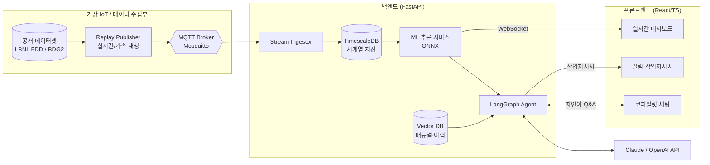
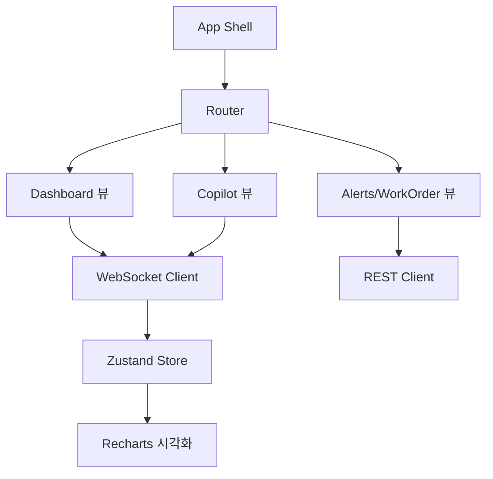
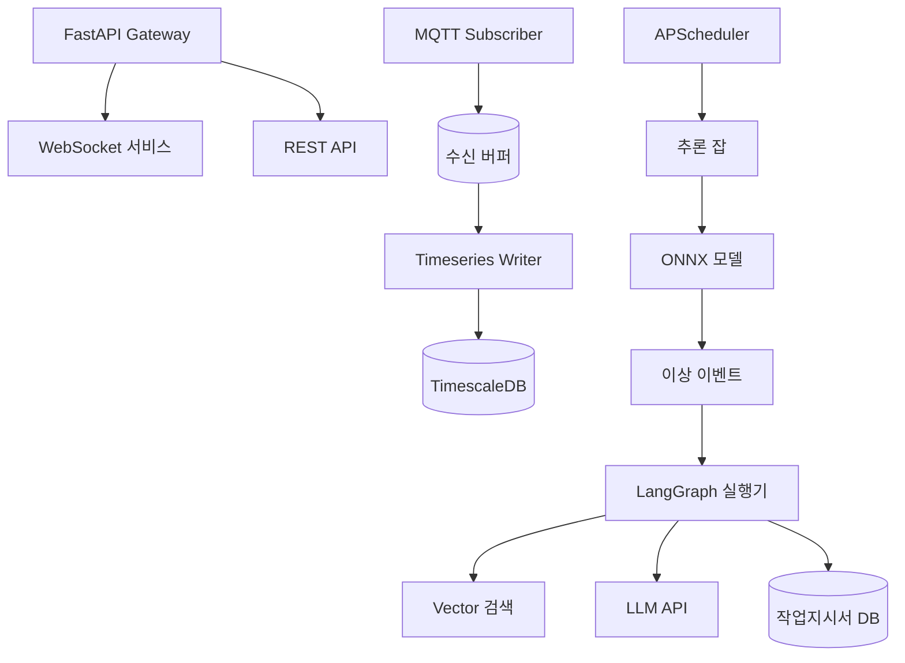
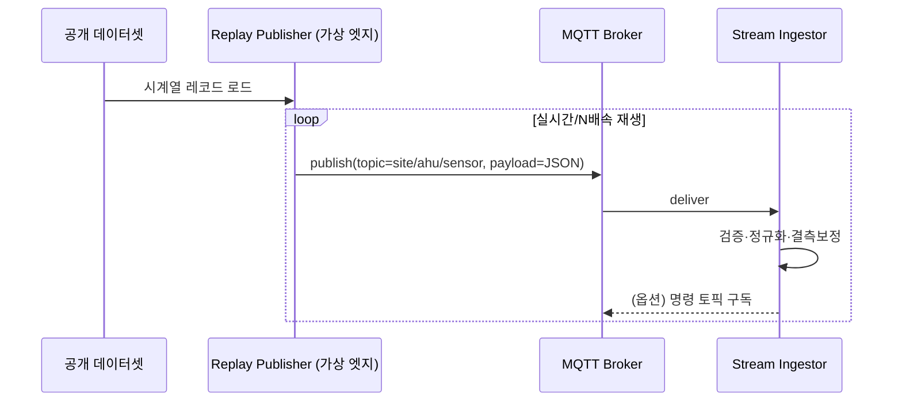
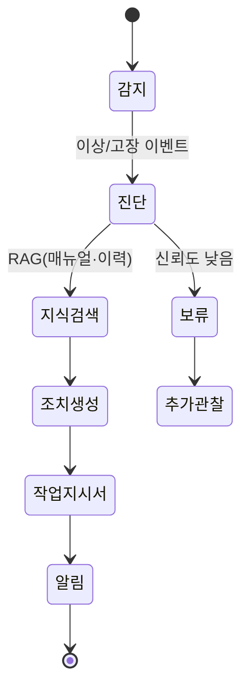
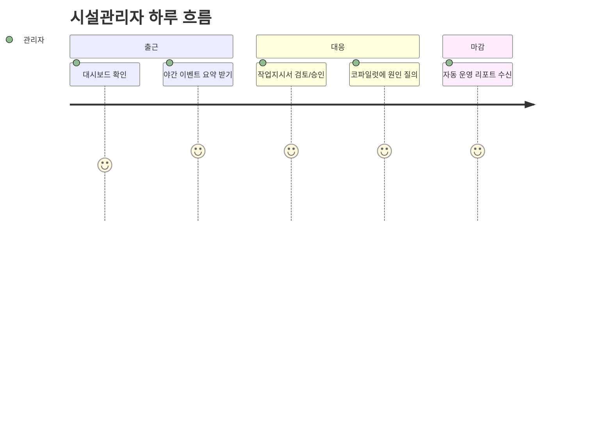
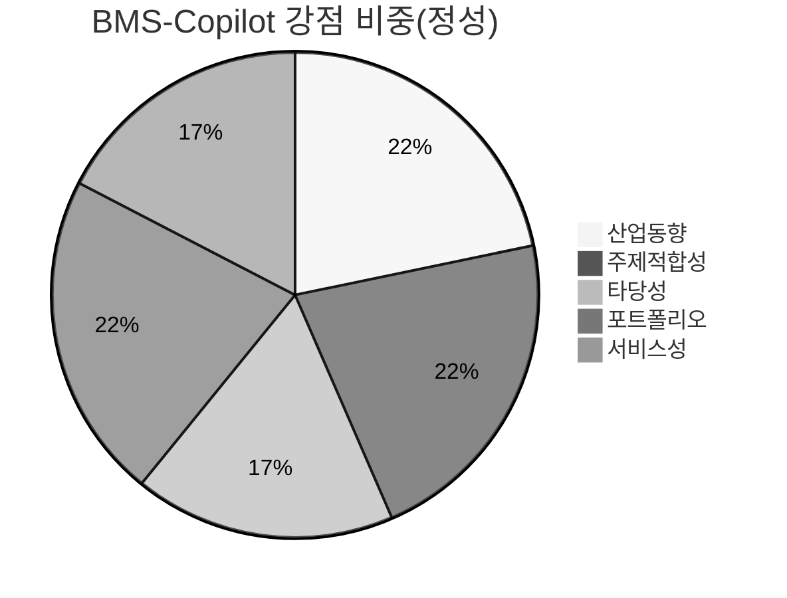

# 주제 01 — BMS-Copilot : 건물 HVAC 설비 예지보전 & 진단 AI Agent

> **한 줄 정의**
> 공개 빌딩 설비 데이터(HVAC)를 실시간 IoT 스트림으로 재현하고, ML/DL로 **고장을 사전 예측·진단**한 뒤, LangGraph 기반 AI Agent가 시설관리자에게 **원인 분석 → 조치안 → 작업지시서**까지 자동 생성해 주는 "설비관리 코파일럿".

---

## 1. 기본 정보

| 항목 | 내용 |
|---|---|
| 프로젝트명 | **BMS-Copilot** (Building-Management-System Copilot) |
| 프로젝트 주제 | AIoT 기반 건물 설비 예지보전 & 대화형 진단 자동화 |
| 개발 기간 | 2026.06.27 ~ 2026.07.19 (약 3주) |
| 개발 인원 | 개인 프로젝트 (풀스택 1인) |
| 데이터 확보 방식 | 공개 IoT 데이터셋 (LBNL FDD, ASHRAE GEPIII / Building Data Genome 2) |
| 개발 범위 | 백엔드(서버·DB·ML/DL·LangGraph) + 프론트엔드(React/TS 대시보드) |
| 도메인 | 스마트빌딩 / 시설 예지보전 (HDC랩스 솔루션사업본부 인접) |

> 💡 **왜 "건물 HVAC 설비"인가?**
> ① 시장: 스마트빌딩이 2022년 4,500만 → 2026년 1.15억 개로 2.5배 폭증, 예지보전 채택률이 1년 만에 2배(9%→18%). ② 데이터: 라벨링된 고품질 공개 데이터셋이 존재해 개인·3주·무하드웨어 제약에서도 **실증 수준의 모델**을 만들 수 있음. ③ 취업: HDC랩스 핵심 사업("플랜트·설비 예지보전")과 직접 맞닿으면서도, 인프라 규모가 아닌 **건물 HVAC + 대화형 에이전트**라는 차별점을 가짐.

---

## 2. 프로젝트 개요

### 2.1 개발 배경
- **산업 동향(AX 전환):** 설비관리 시장이 "고장 나면 고친다(BM)"에서 "고장을 예측해 미리 막는다(PdM)"로 이동 중이며, 2026년 들어 단순 이상탐지를 넘어 **Agentic AI가 직접 조치를 제안·실행**하는 단계로 진입했다. PdM 도입 효과는 돌발고장 25~40%↓, 유지보수비 15~30%↓, 설비수명 10~20%↑로 정량 보고된다.
- **BMS ↔ CMMS 단절:** 건물관리시스템(BMS)이 수집하는 센서 데이터와 유지보수관리시스템(CMMS)의 작업지시가 분리되어, "센서가 이상을 봐도 사람이 해석·작업지시까지 수동으로 잇는" 운영 공백이 존재한다.
- **시설관리자 고령화·인력난:** 숙련자의 경험(어떤 패턴이 어떤 고장인지)이 암묵지로 남아 있어, 신규 인력이 동일 판단을 내리기 어렵다.

### 2.2 문제 정의
> **"건물 설비는 매초 데이터를 쏟아내지만, 정작 '이게 고장 전조인지, 무엇이 원인이고, 무슨 조치를 해야 하는지'는 여전히 숙련 관리자의 머릿속에 있다."**

- **누가 쓰는가(Who):** 빌딩·시설 관리자(FM), 설비 운영팀, 비전문 당직자.
- **왜 필요한가(Why):** ① 돌발고장은 임차인 불만·에너지 낭비·비상출동 비용으로 직결된다. ② 알람은 쏟아지지만 "원인·조치"로 번역되지 않아 알람 피로(alarm fatigue)가 크다. ③ 숙련자 판단을 시스템화해야 인력난·고령화에 대응할 수 있다.
- **무엇을 해결하는가(What):** 센서 스트림 → **이상/고장 예측** → **원인 진단** → **조치안·작업지시서 자동 생성** → **자연어 질의응답**까지의 폐루프를 자동화한다.

### 2.3 핵심 기능 요약
| # | 기능 | 한 줄 설명 |
|---|---|---|
| 1 | 실시간 설비 상태 모니터링 | 가상 IoT 스트림을 실시간 대시보드로 시각화 |
| 2 | 고장 사전 예측·이상 탐지 | 지도(고장 분류) + 비지도(오토인코더) 이중 방어 |
| 3 | 에너지 과소비 탐지 | 사용량 예측 대비 초과분 검출 → 비효율 진단 |
| 4 | AI Agent 진단·조치 자동화 | LangGraph: 감지→진단(RAG)→조치안→작업지시서 |
| 5 | 시설관리 코파일럿(대화) | "3층 AHU 왜 이상이야?" 자연어 질의응답 |

---

## 3. 프로젝트 목표

### 3.1 최종 구현 목표
1. 공개 HVAC 데이터셋을 **MQTT 기반 가상 IoT 스트림**으로 재현하는 데이터 파이프라인.
2. **고장 분류 모델(지도) + 이상 탐지 모델(비지도) + 에너지 예측 모델**의 3종 ML/DL 파이프라인과 MLflow 실험관리.
3. 예측 결과를 입력받아 **진단→조치→작업지시서**를 생성하는 **LangGraph 멀티스텝 Agent**.
4. 실시간 대시보드 + 알림 + 대화형 코파일럿을 갖춘 **React/TS 프론트엔드**.
5. Docker Compose로 **원클릭 재현 가능**한 풀스택 시스템.

### 3.2 사용자가 얻는 가치
- **시설관리자:** 알람 → 즉시 "원인+조치+예상비용"으로 번역, 의사결정 시간 단축.
- **운영 책임자:** 돌발고장·에너지 낭비 감소로 운영비 절감, 데이터 기반 보고.
- **비전문 당직자:** 코파일럿에 물어보면 숙련자 수준의 1차 대응 가능.

---

## 4. 역할 분담

### 4.1 팀 구성과 담당
개인 프로젝트(1인 풀스택). 3주 안에 끝내기 위해 **주차별 수직 슬라이스**로 범위를 통제한다.

| 주차 | 핵심 마일스톤 |
|---|---|
| 1주차 | 데이터 파이프라인(MQTT 스트림) + EDA + 베이스라인 모델 + DB 스키마 |
| 2주차 | 고장/이상/에너지 모델 고도화 + MLflow + 모델 서빙 API |
| 3주차 | LangGraph Agent + RAG + 프론트 대시보드/코파일럿 + Docker 통합·문서화 |

### 4.2 주요 기여 (포트폴리오 어필 포인트)
- **데이터 엔지니어링:** 공개 데이터를 실시간 스트림으로 재현(MQTT/Time-series DB).
- **ML/DL:** 지도·비지도 모델 병행, 불균형·라벨 한계 다루기, MLflow 실험관리·ONNX 서빙.
- **LLM 시스템:** LangGraph 상태기계 설계, RAG로 도메인 지식 결합, 환각 통제.
- **풀스택:** FastAPI(WebSocket) + React/TS 실시간 대시보드 + Docker 통합.

---

## 5. 사용 기술 스택

**프론트엔드**
- React + TypeScript + Vite, TailwindCSS
- Recharts(시계열 차트), WebSocket(실시간 스트림 수신), Zustand(상태관리)

**백엔드**
- Python · FastAPI (REST + WebSocket/SSE)
- Celery / APScheduler (주기적 추론·배치)
- MQTT Broker(Mosquitto) — 가상 IoT 데이터 게이트웨이

**로컬/ML 모델**
- scikit-learn(베이스라인), LightGBM/XGBoost(고장 분류·에너지 예측)
- PyTorch(LSTM·Autoencoder 기반 이상탐지, Transformer 옵션)
- MLflow(실험·모델 레지스트리), ONNX Runtime(서빙)

**API / 외부 연동**
- LangGraph · LangChain (멀티스텝 에이전트)
- Claude API (`claude-opus-4-8` 등) / OpenAI — 진단·요약·대화
- pgvector or Chroma (설비 매뉴얼·유지보수 이력 RAG)
- PostgreSQL + TimescaleDB(시계열), Redis(캐시·세션)
- Docker Compose, GitHub Actions(CI)

> 💡 **왜 이 스택인가?** ① TimescaleDB/MQTT는 "IoT 스트림"이라는 주제 정체성을 코드로 증명한다. ② MLflow+ONNX는 "모델을 만들었다"를 넘어 "운영 가능하게 서빙했다"는 **MLOps 역량**을 보여준다. ③ LangGraph는 단순 프롬프트 체인이 아니라 **분기·재시도·상태관리가 있는 워크플로우**라 "AI Agent 자동화" 요건을 정면으로 충족한다.

---

## 6. 시스템 아키텍처

### 6.1 전체 프로젝트 아키텍처

> 💡 **왜 MQTT 재생 구조인가?** 하드웨어가 없어도 "실시간 IoT 운영 환경"을 충실히 모사하기 위해서다. 공개 데이터셋을 단순 CSV로 batch 학습만 하면 "IoT 통합 서비스"가 아니라 "데이터 분석 노트북"이 된다. **데이터셋을 시간축 그대로 스트리밍**함으로써 실시간 탐지·알림·에이전트 반응이라는 서비스 본질을 살린다. 동일 인터페이스로 **추후 실제 ESP32/센서 연동이 가능**하도록 설계한다.

### 6.2 프론트엔드 아키텍처

### 6.3 백엔드 아키텍처

### 6.4 데이터 수집·엣지 아키텍처 (원 ToC의 "아두이노 아키텍처" 대체)

> 💡 **왜 이 구조인가?** 개인·무하드웨어 제약을 정직하게 인정하되, **"가상 엣지 디바이스(Replay Publisher) → MQTT → 수집"** 이라는 실제 IoT 토폴로지를 그대로 구현한다. 토픽 스키마·payload 포맷·QoS를 실제 센서와 동일하게 맞춰, 코드 변경 없이 실물 센서로 교체 가능한 확장성을 확보한다.

---

## 7. 핵심 기능

### 7.1 센서 기반 상태 인식 (실시간 모니터링)
- 다변량 시계열(온도·압력·유량·밸브/댐퍼 개도·팬속도 등)을 실시간 카드/차트로 표시.
- 정상 범위 대비 편차를 색상으로 즉시 인지.

### 7.2 고장 예측 & 이상 탐지 (ML/DL 핵심)
- **지도학습(고장 분류):** LBNL FDD의 라벨(정상/고장유형)로 LightGBM·XGBoost 분류 → "어떤 고장인지" 식별.
- **비지도(이상 탐지):** 정상 상태만 학습한 **LSTM-Autoencoder**의 재구성오차로 미지의 이상 포착 → 라벨이 없는 신규 패턴 방어.
- **에너지 예측:** ASHRAE/BDG2로 사용량 예측 → 예측 대비 초과분으로 **비효율·과소비** 검출.
- **이중 방어 논리:** 분류가 못 잡는 신종 이상은 오토인코더가, 오토인코더가 모호한 건 분류가 해석.

> 💡 **왜 지도+비지도 병행?** 실제 설비 데이터는 고장 라벨이 희소·불균형하다. 라벨 있는 고장은 분류로 정확히, 라벨 없는 미지 이상은 비지도로 폭넓게 잡아 **현실의 데이터 한계**를 정면으로 다룬다 — 채용 관점에서 "데이터를 안다"는 신호.

### 7.3 선제 반응 및 이벤트 처리 (AI Agent 자동화)

- LangGraph 노드: **감지 → 원인 진단 → RAG 지식검색 → 조치안 생성 → 작업지시서 발행 → 알림**.
- 신뢰도가 낮으면 즉시 단정하지 않고 "추가 관찰" 분기 → **환각·오경보 통제**.

### 7.4 세션 및 기록 관리
- 이벤트·작업지시서·대화 이력을 DB에 저장, 설비별 타임라인 제공.
- "이 설비에 지난달 무슨 일이 있었나?" 질의 시 이력 기반 답변(RAG).

### 7.5 다양한 실행·테스트 환경
- `docker compose up` 원클릭 실행, 데이터 재생속도(1x/60x) 조절.
- 시나리오 주입(특정 고장 케이스 재생)으로 데모·테스트 재현성 확보.

---

## 8. 아이디어 기획 배경 및 필요성

### 8.1 기존 설비관리 방식의 한계
- 사후정비(고장 후 수리)·시간기준 예방정비(TBM)는 과잉정비 또는 돌발고장을 유발.
- BMS 알람은 "임계치 초과" 수준에 머물러 **원인·조치로 번역되지 않음**.

### 8.2 센서 기반 예지보전의 필요성
- 다변량 시계열 패턴은 사람이 실시간 해석 불가 → ML/DL이 전조를 포착해야 함.
- 고장 20일 전 예측 사례처럼, **선제 개입의 경제적 효과가 정량적으로 입증**됨.

### 8.3 대화형 AIoT Agent 적용 가능성
- 2026년 트렌드는 "이상탐지"를 넘어 **에이전트가 조치까지 수행**하는 폐루프.
- LLM이 숙련자 암묵지(매뉴얼·과거 이력)를 RAG로 결합해 **1차 진단·조치를 자동화**.

### 8.4 기존 솔루션(HDC랩스 포함) 대비 차별성
| 구분 | 기존/HDC 방향 | 본 프로젝트 차별점 |
|---|---|---|
| 대상 | 대규모 플랜트·설비 예지보전 | 건물 HVAC + 보편적 시설 |
| 산출물 | 이상 감지·대시보드 중심 | **조치안·작업지시서까지 자동 생성** |
| 인터페이스 | 관제 화면 | **자연어 코파일럿(대화형)** |
| 지식 활용 | 룰/임계치 | **RAG로 매뉴얼·이력 결합** |

> 💡 HDC랩스의 강점(현장 규모·하드웨어)과 경쟁하지 않고, **"감지 이후의 의사결정 자동화(코파일럿)"**라는 소프트웨어 레이어에서 보완·차별화한다.

---

## 9. 서비스 기획안

### 9.1 주요 사용자 시나리오
1. 3층 AHU 토출온도 이상 → 시스템이 "냉수밸브 고착 의심" 진단 → 점검 작업지시서 자동 발행.
2. 당직자가 코파일럿에 "이 알람 위험해?"라고 질문 → 위험도·원인·1차 조치 안내.
3. 월말 운영 책임자가 "이번 달 비효율 Top5 설비" 리포트 요청 → 자동 생성.

### 9.2 사용자 경험 흐름

### 9.3 핵심 서비스 기능 구성
- 실시간 모니터링 · 예측 경보 · 자동 진단/작업지시 · 대화형 코파일럿 · 운영 리포트.

### 9.4 기대되는 사용자 가치
- 의사결정 시간↓, 돌발고장·에너지낭비↓, 비전문가 대응력↑, 운영 데이터 자산화.

### 9.5 운영 및 확장 방향
- 실물 센서/BMS 연동, CMMS 연계(작업지시 자동 등록), 멀티빌딩 포트폴리오 관제로 확장.

---

## 10. 기대효과 및 발전 가능성

### 10.1 돌발고장·운영비 절감
- PdM 일반 효과(돌발고장 25~40%↓)를 데모 데이터로 정량 시연.

### 10.2 데이터 기반 운영 경험 고도화
- 알람 피로 완화, 원인·조치 중심의 운영 문화로 전환.

### 10.3 숙련 지식의 시스템화
- 매뉴얼·이력 RAG로 암묵지를 조직 자산화 → 인력난·고령화 대응.

### 10.4 AIoT 시설관리 플랫폼으로의 확장
- 건물 → 캠퍼스/단지 → 인프라(지역난방·승강기 등)로 도메인 확장 가능.

### 10.5 향후 개선·고도화 방향
- 강화학습 기반 자동 제어, 디지털 트윈 연계, 멀티에이전트(진단·발주·검증 분업).

---

## 부록. 스타 차트(오각형) 자기평가

| 평가축 | 점수(5점) | 근거 |
|---|---|---|
| 산업 동향 | ★★★★★ | PdM 채택 2배↑, Agentic AI 조치 자동화로 이동, 스마트빌딩 2.5배 성장 |
| 주제 적합성 | ★★★★★ | IoT 외부데이터 + ML 학습 + AI Agent 자동화 3요건 정확히 충족, HDC 핵심사업 인접 |
| 타당성(3주·1인·무HW) | ★★★★ | 라벨링 공개 데이터셋 존재로 실증 가능, 단 모델 3종+Agent로 일정 빡빡 |
| 포트폴리오 가능성 | ★★★★★ | 데이터엔지니어링+MLOps+LLM Agent+풀스택을 한 번에 증명 |
| 서비스성 | ★★★★ | B2B 시설관리 명확한 수요, 단 즉시 매출보다 운영효율형 |

> **종합:** 오각형이 "주제 적합성·산업 동향·포트폴리오" 축에서 최대치에 가까워 **취업 포트폴리오로서 면적이 가장 큰** 안. 리스크는 일정(모델 3종+Agent)이며, 수직 슬라이스로 통제한다.

---

### 참고 출처
- [Predicting the Next Service Call — ACHR News](https://www.achrnews.com/articles/166317-predicting-the-next-service-call)
- [Reducing HVAC Downtime with AI Predictive Maintenance — Oxmaint](https://oxmaint.com/industries/facility-management/reducing-hvac-downtime-ai-predictive-maintenance)
- [LBNL Fault Detection and Diagnostics Datasets — OEDI](https://data.openei.org/submissions/5763)
- [A labeled dataset for building HVAC systems (Scientific Data, 2023)](https://www.nature.com/articles/s41597-023-02197-w)
- [Building Data Genome Project 2 / ASHRAE GEPIII (Scientific Data)](https://www.nature.com/articles/s41597-020-00712-x)
- [스마트 빌딩, 2026년 현재 미래를 열다 — 한국공공정책신문](http://knpp.co.kr/news/471668)
- [Smart Buildings Achieve 86% Energy Savings With AI Agents — Quantum Zeitgeist](https://quantumzeitgeist.com/86-percent-ai-smart-buildings-energy-savings-agents/)

---

## 지표 기반 평가 (00 지표 적용)

### 점수 기록표

| 번호 | 평가 항목 | 배점 | 점수 | 근거 |
|-:|---|-:|-:|---|
| 1 | 4주 내 개인 수행 | 15 | 13 | 가능하나 모델 3종+Agent로 일정 빡빡 → 수직 슬라이스로 통제 |
| 2 | AIoT Agent 서비스화 가치 | 15 | 13 | B2B 시설관리 명확 수요, 단 상용 포화 |
| 3 | 공개 데이터셋 | 10 | 9 | LBNL FDD / BDG2 (고장 라벨 공개) |
| 4 | 주제 선택 근거 | 10 | 8 | 직무 적합성 명확, 단 차별 근거 보완 필요 |
| 5 | 타깃 사용자 정의 | 10 | 9 | 시설관리자(FM)·운영팀·당직자 |
| 6 | 사용자 필요성·문제 강도 | 10 | 9 | 알람→원인·조치 번역, 인력난·고령화 |
| 7 | LangChain/LangGraph | 10 | 9 | 감지→진단(RAG)→조치→작업지시→분기 필수 |
| 8 | HW 목업·SW 구현 | 10 | 10 | 공개데이터로 완결 |
| 9 | 전공+NOVA 연계 | 5 | 4 | HVAC는 계측 인접(전공 중간) + Agent·대시보드(NOVA) |
| 10 | PHM 기반·PdM 목적 | 5 | 5 | 고장 예측(PHM) → 정비 조치(PdM) 폐루프 명확 |
| | **총점** | **100** | **89** | |

### 필수 통과 조건

| 필수 조건 | 통과 | 근거 |
|---|:--:|---|
| 4주 내 MVP | ✅ | 범위 조정 시 가능 |
| 공개 데이터셋 | ✅ | LBNL FDD/BDG2 |
| AIoT Agent 가치 | ✅ | 진단·조치 자동화 |
| LangChain/LangGraph | ✅ | 멀티스텝·분기 필수 |
| 소프트웨어 중심 | ✅ | 무HW 완결 |

## 최종 판단

- 총점: **89 / 100**
- 판단 결과: **채택 권장**
- 핵심 강점:
  - 설비 예지보전 직무 적합성 최고(설비 AX 대기업 인접)
  - 고장 라벨 공개데이터로 PHM 실증 가능
  - PHM→PdM 폐루프(진단·작업지시)가 자연스러움
- 주요 리스크:
  - **BrainBox AI ARIA와 컨셉 거의 동일**(2025.1 Trane 인수) → 클론 리스크
  - 모델 3종+Agent로 4주 일정 빡빡
- 보완 방향:
  - 차별점을 좁힘(라벨 진단 설명가능성·CMMS 연계 등)
  - 수직 슬라이스로 범위 통제

## 최종 선정 여부

해당 주제는 **직무 적합성과 PHM→PdM 폐루프가 강하나 상용 클론 리스크가 있는** 이유로 인해 프로젝트 주제로 **채택 권장(차별점 보강 조건)** 한다.
