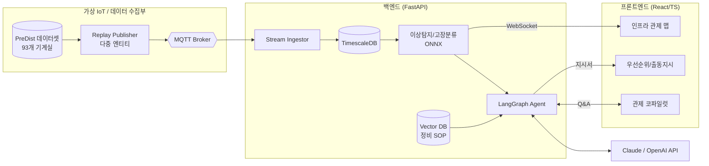
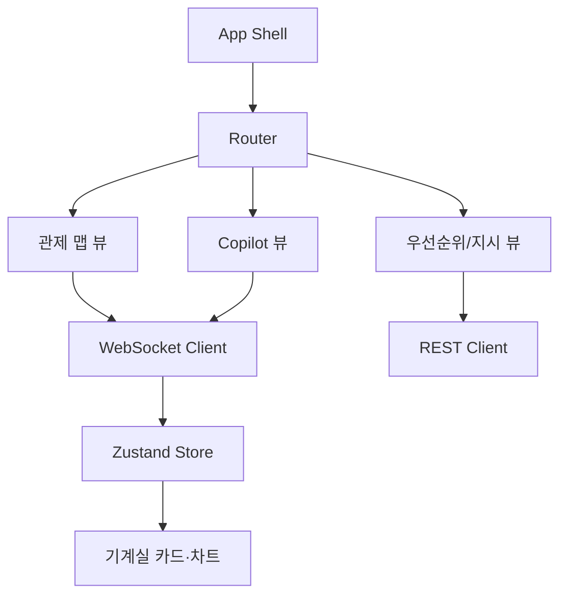
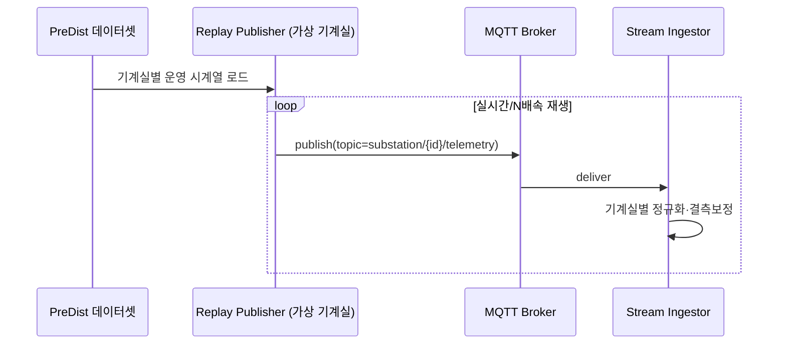
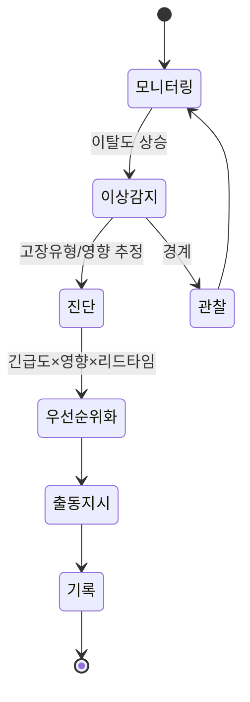
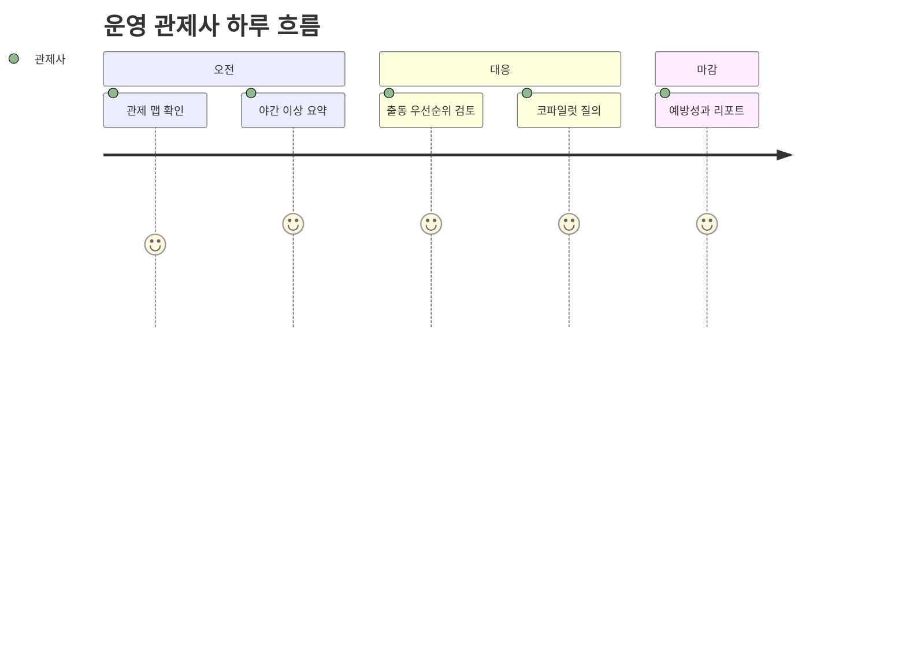
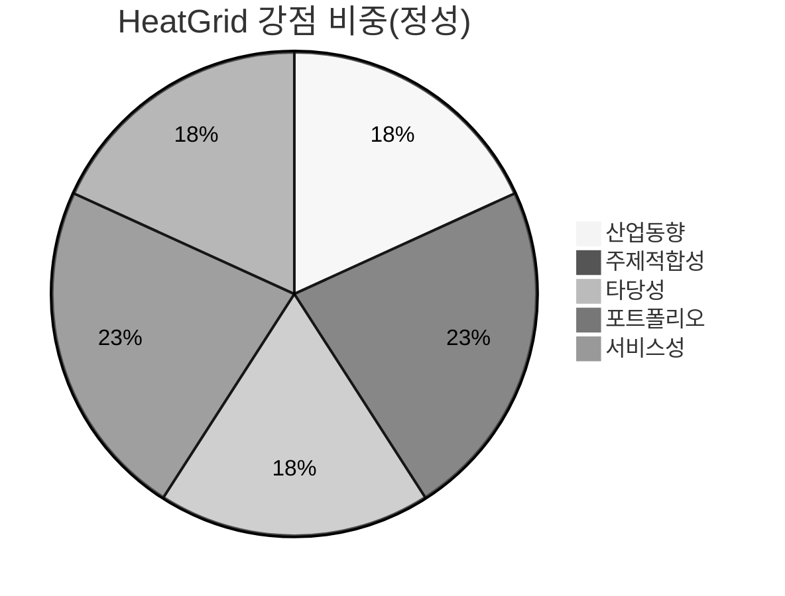

# 주제 02 — HeatGrid : 지역난방 인프라 운영 AIoT Agent

> **문서 역할**
> 주제 제안서 / 전체 청사진

> **한 줄 정의**
> 공개 지역난방 기계실(substation) 운영 데이터를 실시간 IoT 스트림으로 재현하고, ML/DL로 **이상 징후·리드타임·위험도**를 계산한 뒤, LangGraph AI Agent가 **상황 판단 → 대응 우선순위화 → 출동 계획 → 재계획**까지 수행하는 "도시 열에너지 인프라 운영 AIoT Agent".

---

## 1. 기본 정보

| 항목 | 내용 |
|---|---|
| 프로젝트명 | **HeatGrid** |
| 프로젝트 주제 | AIoT 기반 지역난방 기계실 운영 의사결정 & 동적 대응 자동화 |
| 개발 기간 | 2026.06.27 ~ 2026.07.19 (약 3주) |
| 개발 인원 | 개인 프로젝트 (풀스택 1인) |
| 데이터 확보 방식 | 공개 데이터셋 (PreDist — 93개 지역난방 기계실 라벨링 운영데이터, Zenodo 2025.11) |
| 개발 범위 | 백엔드(서버·DB·ML/DL·LangGraph) + 프론트엔드(React/TS 인프라 관제) |
| 도메인 | 인프라 / 열에너지 (HDC랩스 건설사업본부 인프라 인접) |

> 💡 **왜 "지역난방 인프라"인가?**
> ① 차별화: 주제 01(건물 HVAC)이 **건물 단위 설비**라면, 이건 **수백 개 기계실로 이루어진 도시 인프라 네트워크** — 규모·도메인이 명확히 다르다. 국내는 지역난방 보급률이 높아 현실 적합성이 크다. ② 데이터: 2025년 11월 공개된 **PreDist 데이터셋(93개 기계실, 고장/정비 라벨)**로 실증 가능하며, 선행 모델이 **고장의 60%를 고객 신고 3~5일 전 탐지**. ③ 취업: HDC랩스 인프라본부와 직접 닿으면서, "고객 신고 전 선제 정비"라는 명확한 비즈니스 가치.

---

## 2. 프로젝트 개요

### 2.1 개발 배경
- **AX·인프라 전환:** 도시 인프라 운영이 "신고 받고 출동"에서 **"데이터로 미리 감지하고, 계획을 세우고, 차질 시 다시 조정"**하는 방향으로 이동. 에너지 시스템 이상탐지 오픈소스(EnergyFaultDetector)와 공개 라벨 데이터가 등장하며 진입장벽이 낮아짐.
- **분산·대수의 운영:** 기계실이 수백 개로 분산되어, 사람이 전수 모니터링은 불가 → 우선순위화가 핵심.
- **고객 신고 의존:** 현재는 고객이 "추워요"라고 신고해야 인지 → 이미 서비스 품질이 깨진 시점.
- **동적 운영 제약:** 출동팀, 점검 슬롯, 권역 이동, 부품 준비 시간처럼 운영 제약이 계속 바뀌므로 정적 룰만으로 대응하기 어렵다.

### 2.2 문제 정의
> **"도시 열 공급은 수백 개 기계실에 의존하고, 운영자는 늘 제한된 자원 아래 지금 어디를 먼저 보고, 어떤 계획을 바꾸어야 하는지 판단해야 한다."**

- **누가 쓰는가(Who):** 지역난방 운영센터 관제사, 정비팀, 설비 엔지니어.
- **왜 필요한가(Why):** ① 고장의 상당수는 운영데이터에 전조가 있으나 임계 알람으로는 못 잡는다. ② 출동 자원은 한정되어 있어 위험·영향·리드타임을 함께 봐야 한다. ③ 계획을 세운 뒤에도 신규 이상, 일정 지연, 신뢰도 부족이 생겨 재판단이 필요하다. ④ 동절기 공급 중단은 직접적 민원·안전 문제다.
- **무엇을 해결하는가(What):** 기계실 스트림 → **이상 징후 감지** → **위험도·리드타임 계산** → **대응 우선순위화** → **출동 계획 수립** → **차질 발생 시 재계획**까지의 운영 폐루프 자동화.

### 2.3 핵심 기능 요약
| # | 기능 | 한 줄 설명 |
|---|---|---|
| 1 | 다수 기계실 인프라 관제 | 네트워크 전체 상태를 지도/그리드로 시각화 |
| 2 | 이상 징후·고장 조기 예측 | 정상행동 모델 대비 이탈로 조기 탐지 |
| 3 | 위험도·리드타임 추정 | 어떤 고장·언제쯤 발생할지와 영향도를 계산 |
| 4 | AI Agent 운영 판단 | LangGraph: 감지→진단→우선순위→출동 계획→재계획 |
| 5 | 관제 코파일럿(대화) | "오늘 우선 점검 기계실?" 자연어 질의 |

---

## 3. 프로젝트 목표

### 3.1 최종 구현 목표
1. PreDist 데이터를 **MQTT 가상 기계실 스트림(다중 엔티티)**으로 재현하는 파이프라인.
2. **정상행동 이상탐지(비지도) + 고장유형 분류(지도) + 리드타임 추정** ML/DL + MLflow.
3. 예측을 입력받아 **진단·우선순위·출동 지시서**를 만드는 **LangGraph Agent**.
4. 인프라 네트워크 **관제 대시보드 + 알림 + 코파일럿** React/TS 프론트.
5. Docker Compose **원클릭 재현**.

### 3.2 사용자가 얻는 가치
- **관제사:** 수백 기계실 중 "지금 봐야 할 곳"을 자동 선별.
- **정비팀:** 영향·긴급도 기반 출동 우선순위와 예상 원인 사전 파악.
- **운영사:** 공급중단·민원 감소, 정비 인력 효율 극대화.

---

## 4. 역할 분담

### 4.1 팀 구성과 담당
개인 프로젝트(1인 풀스택). 주차별 수직 슬라이스로 통제.

| 주차 | 핵심 마일스톤 |
|---|---|
| 1주차 | 데이터 파이프라인(다중 기계실 MQTT) + EDA + 이상탐지 베이스라인 + DB |
| 2주차 | 고장분류·리드타임 모델 + 평가(F-score·earliness) + MLflow + 서빙 |
| 3주차 | LangGraph Agent + 관제 대시보드/코파일럿 + Docker 통합·문서화 |

### 4.2 주요 기여 (포트폴리오 어필 포인트)
- **데이터 엔지니어링:** 수십~수백 엔티티 시계열의 멀티테넌트 스트림 처리.
- **ML/DL:** 정상행동 학습 기반 조기탐지, **earliness(조기성) 지표**까지 다룸.
- **LLM 시스템:** 우선순위·출동 지시 자동화, 운영 SOP RAG 결합.
- **풀스택:** 인프라 네트워크 관제 UI(지도/그리드) + Docker.

---

## 5. 사용 기술 스택

**프론트엔드**
- React + TypeScript + Vite, TailwindCSS
- Recharts(시계열), 지도/그리드 관제 뷰, WebSocket, Zustand

**백엔드**
- Python · FastAPI (REST + WebSocket/SSE), APScheduler
- MQTT Broker(Mosquitto) — 가상 기계실 게이트웨이

**로컬/ML 모델**
- scikit-learn, LightGBM(고장분류·리드타임)
- PyTorch(LSTM-Autoencoder 정상행동/이상탐지)
- (옵션) EnergyFaultDetector 류 오픈소스 참고
- MLflow(실험관리), ONNX Runtime(서빙)

**API / 외부 연동**
- LangGraph · LangChain, Claude API(`claude-opus-4-8`)/OpenAI
- pgvector or Chroma (정비 SOP·고장 사례 RAG)
- PostgreSQL + TimescaleDB(시계열), Redis
- (옵션) 외기온 등 기상 데이터 연동(난방 부하 보정)
- Docker Compose, GitHub Actions(CI)

> 💡 **왜 정상행동(비지도) 중심인가?** 인프라 고장 라벨은 희소하다. **정상 운영만 학습한 모델의 이탈도**로 미지 고장까지 조기 포착하고(선행 연구는 고장 60%를 신고 3~5일 전 탐지), 라벨 있는 케이스는 분류로 유형을 특정한다.

---

## 6. 시스템 아키텍처

### 6.1 전체 프로젝트 아키텍처


> 💡 **왜 다중 엔티티 스트림인가?** 인프라의 본질은 "대수(大數)의 분산 설비"다. 한 기계실이 아니라 수십~수백 개를 동시 스트리밍·추론·우선순위화하는 구조가 이 주제의 기술적 차별점이자 난도다.

### 6.2 프론트엔드 아키텍처


### 6.3 백엔드 아키텍처
```mermaid
flowchart TD
    GW[FastAPI Gateway] --> WSV[WebSocket 서비스]
    GW --> REST[REST API]
    SUB[MQTT Subscriber] --> WRITE[Timeseries Writer] --> TSDB[(TimescaleDB)]
    SCH[APScheduler] --> INFER[추론 잡(기계실별)]
    INFER --> AD[이상탐지 ONNX]
    INFER --> CLF[고장분류/리드타임 ONNX]
    AD & CLF --> AGRUN[LangGraph 실행기]
    AGRUN --> RAG[Vector 검색]
    AGRUN --> LLM[LLM API]
    AGRUN --> WO[(출동지시 DB)]
```

### 6.4 데이터 수집·엣지 아키텍처 (원 ToC의 "아두이노 아키텍처" 대체)

> 💡 **왜 이 구조인가?** "가상 기계실(엔티티별 publisher)"이 MQTT로 텔레메트리를 발행하는 실제 인프라 IoT 토폴로지를 모사. 토픽에 기계실 ID를 두어 멀티테넌트 추론·관제가 가능하며, 추후 실물 RTU/PLC 연동으로 교체 가능.

---

## 7. 핵심 기능

### 7.1 센서 기반 상태 인식 (인프라 관제)
- 다수 기계실의 공급/환수 온도·차압·유량 등을 맵·그리드로 표시, 위험도 색상화.

### 7.2 고장 예측 & 이상 탐지 (ML/DL 핵심)
- **비지도(정상행동):** LSTM-Autoencoder로 기계실별 정상 패턴 학습 → 이탈도로 조기탐지.
- **지도(고장분류):** 라벨 케이스로 고장유형 분류 + 영향도 추정.
- **리드타임 추정:** "며칠 내 발생 가능성"으로 정비 일정 최적화.
- **평가지표:** 정확도뿐 아니라 **eventwise F-score·earliness(조기성)**로 실제 운영가치 평가.

> 💡 **왜 earliness를 평가하나?** "맞췄나"보다 "얼마나 빨리 맞췄나"가 인프라 정비의 가치다. 신고 3~5일 전 탐지가 출동 계획·자재 준비 시간을 만든다.

### 7.3 선제 반응 및 이벤트 처리 (AI Agent 자동화)

- LangGraph 노드: **감지 → 진단 → 우선순위화 → 출동 지시서 → 기록**.
- 다수 이벤트를 **긴급도×영향×리드타임**으로 정렬해 제한된 정비자원 배분.

### 7.4 세션 및 기록 관리
- 기계실별 이벤트·정비 이력 저장, "이 기계실 반복 이상" 패턴 분석(RAG).

### 7.5 다양한 실행·테스트 환경
- `docker compose up` 원클릭, 특정 기계실 고장 시나리오 주입으로 데모 재현.

---

## 8. 아이디어 기획 배경 및 필요성

### 8.1 기존 인프라 운영 방식의 한계
- 임계 알람·고객 신고 의존 → 사후 대응, 품질 저하 후 인지.

### 8.2 센서/데이터 기반 예지보전의 필요성
- 운영데이터에 전조가 선행 → 조기탐지로 공급중단·민원 예방.

### 8.3 대화형 AIoT Agent 적용 가능성
- 수백 기계실을 동시 평가·우선순위화하고, 정비 SOP를 결합해 출동지시 자동화.

### 8.4 기존 솔루션(HDC랩스 포함) 대비 차별성
| 구분 | 기존/HDC·주제01 | 본 프로젝트 차별점 |
|---|---|---|
| 규모 | 단일 건물/플랜트 설비 | **수백 기계실 인프라 네트워크** |
| 탐지 | 임계/룰 알람 | **정상행동 이탈 + 조기성(earliness)** |
| 산출 | 알람·대시보드 | **우선순위화된 출동 지시서** |
| 평가 | 정확도 | **조기 탐지·운영가치 중심 지표** |

> 💡 HDC 인프라 역량과 정면 경쟁하지 않고, **"대수의 분산 설비를 우선순위화하는 운영 지능"** 레이어로 보완·차별화.

---

## 9. 서비스 기획안

### 9.1 주요 사용자 시나리오
1. A기계실 환수온도 패턴 이탈 → "열교환기 이상 의심, 2~3일 내 위험" 진단·출동 지시.
2. 관제사가 코파일럿에 "오늘 우선 점검 5곳?" 질의 → 우선순위 리스트 응답.
3. 주간 "조기탐지 성공·예방 건수" 운영 리포트 자동 생성.

### 9.2 사용자 경험 흐름


### 9.3 핵심 서비스 기능 구성
- 인프라 관제 · 조기 고장탐지 · 진단/우선순위 · 출동지시 자동화 · 운영 리포트.

### 9.4 기대되는 사용자 가치
- 공급중단·민원↓, 정비자원 효율↑, 선제 정비로 비용·리스크↓.

### 9.5 운영 및 확장 방향
- 실물 RTU/PLC 연동, GIS 결합, 열·전기·수도 등 도시 인프라 통합 관제로 확장.

---

## 10. 기대효과 및 발전 가능성

### 10.1 공급 안정성·민원 저감
- 고객 신고 전 선제 정비로 동절기 공급중단 리스크 완화.

### 10.2 데이터 기반 운영 고도화
- 임계 알람에서 조기탐지·우선순위 운영으로 전환.

### 10.3 정비자원 효율 극대화
- 영향·긴급도 기반 출동으로 한정 인력 최적 배분.

### 10.4 도시 인프라 통합 관제로의 확장
- 지역난방 → 열·전기·수도·승강기 등 멀티 인프라 플랫폼.

### 10.5 향후 개선·고도화 방향
- 디지털 트윈 연계, 부하예측 결합, 멀티에이전트(진단·배차·검증).

---

## 부록. 스타 차트(오각형) 자기평가

| 평가축 | 점수(5점) | 근거 |
|---|---|---|
| 산업 동향 | ★★★★ | 인프라 예지보전·에너지 이상탐지 오픈소스화, 국내 지역난방 적합 |
| 주제 적합성 | ★★★★★ | IoT+ML+Agent 충족, HDC 인프라본부 직접 인접, 01과 명확히 차별 |
| 타당성(3주·1인·무HW) | ★★★★ | 2025.11 라벨 공개데이터 존재, 단 다중 엔티티 처리로 난도 있음 |
| 포트폴리오 가능성 | ★★★★★ | 멀티테넌트 스트림·조기성 지표·우선순위 Agent로 시스템 깊이 어필 |
| 서비스성 | ★★★★ | B2B 인프라 운영 명확 수요, 공익성·비용효과 큼 |



> **종합:** "주제 적합성·포트폴리오" 축이 최대치인, HDC 인프라본부 정조준 안. 다중 엔티티·조기성 지표라는 차별 난도가 포트폴리오 깊이를 만든다.

---

### 참고 출처
- [PreDist Dataset — 지역난방 기계실 라벨링 운영데이터 (Zenodo, 2025.11)](https://zenodo.org/records/17522255)
- [Enabling Predictive Maintenance in District Heating Substations (arXiv 2511.14791)](https://arxiv.org/abs/2511.14791)
- [Fault and anomaly detection in district heating substations: A survey (ResearchGate)](https://www.researchgate.net/publication/370164650_Fault_and_anomaly_detection_in_district_heating_substations_A_survey_on_methodology_and_data_sets)

---

## 지표 기반 평가 (00 지표 적용)

### 점수 기록표

| 번호 | 평가 항목 | 배점 | 점수 | 근거 |
|-:|---|-:|-:|---|
| 1 | 4주 내 개인 수행 | 15 | 12 | 다중 엔티티(수백 기계실) 처리로 난도 있음 |
| 2 | AIoT Agent 서비스화 가치 | 15 | 13 | B2B 인프라 운영, 고객 신고 전 선제 정비 |
| 3 | 공개 데이터셋 | 10 | 9 | PreDist(93개 기계실 라벨, 2025.11) |
| 4 | 주제 선택 근거 | 10 | 9 | 인프라 직무 + 도시 규모로 01과 차별 |
| 5 | 타깃 사용자 정의 | 10 | 9 | 지역난방 운영센터 관제사·정비팀 |
| 6 | 사용자 필요성·문제 강도 | 10 | 9 | 동절기 공급중단 직결, 출동 자원 우선순위 |
| 7 | LangChain/LangGraph | 10 | 9 | 감지→진단→우선순위→출동지시→검증 |
| 8 | HW 목업·SW 구현 | 10 | 10 | 공개데이터로 완결 |
| 9 | 전공+NOVA 연계 | 5 | 4 | 열·유량·압력 계측 인접(전공 중간) + NOVA |
| 10 | PHM 기반·PdM 목적 | 5 | 5 | 고장 예측(PHM) → 정비 우선순위·출동(PdM) |
| | **총점** | **100** | **89** | |

### 필수 통과 조건

| 필수 조건 | 통과 | 근거 |
|---|:--:|---|
| 4주 내 MVP | ✅ | 다중 엔티티 범위 통제 시 가능 |
| 공개 데이터셋 | ✅ | PreDist |
| AIoT Agent 가치 | ✅ | 진단·우선순위·출동 자동화 |
| LangChain/LangGraph | ✅ | 멀티스텝 필수 |
| 소프트웨어 중심 | ✅ | 무HW 완결 |

## 최종 판단

- 총점: **89 / 100**
- 판단 결과: **채택 권장**
- 핵심 강점:
  - 인프라 예지보전 직무 적합성(HD현대·인프라 인접)
  - 2025.11 라벨 공개데이터로 PHM 실증
  - 다중 엔티티 우선순위화로 시스템 깊이
- 주요 리스크:
  - 도메인 설명 난도 높음
  - 01 BMS와 "예지보전 코파일럿" 메시지 일부 겹침
- 보완 방향:
  - 도시 인프라·다중 엔티티 차별을 분명히
  - 다중 엔티티 범위를 MVP로 통제

## 최종 선정 여부

해당 주제는 **인프라 직무 적합성과 PHM→PdM 우선순위화가 강하나 도메인 난도가 있는** 이유로 인해 프로젝트 주제로 **채택 권장** 한다.
