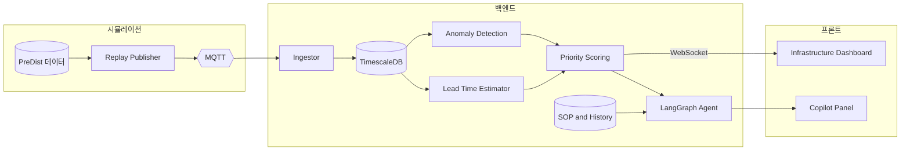

# 주제 17 — HeatGrid : 도시 열인프라 운영 판단·재계획 Agent

> **문서 역할**
> 포지셔닝 보강 / 운영 문제 정의서

> **한 줄 정의**
> 공개 지역난방 기계실 데이터(PreDist)를 이용해 여러 기계실의 운영 상태를 실시간 스트림처럼 재현하고, 각 기계실의 **이상 징후·고장 리드타임·영향도**를 추정한 뒤, **제한된 출동 자원 아래 계획을 세우고, 차질이 생기면 다시 재계획하는** 도시 열인프라 운영 Agent.

---

## 1. 재정의된 포지셔닝

기존 설명의 약점은 `지역난방 기계실 예지보전`이 BMS 계열 주제와 비슷하게 들리고, Agent의 필요성이 약하게 보인다는 점이다.  
이 문서는 HeatGrid를 **건물 설비 모니터링**이 아니라, **도시 단위로 분산된 다중 엔티티 인프라의 운영 판단과 재계획 문제**로 다시 정의한다.

- **핵심 문제:** 고장을 예측하는 것보다, **수십~수백 개 기계실 중 오늘 어디를 먼저 보내고, 계획이 틀어지면 무엇을 바꿀지 결정하는 것**
- **차별 축:** 단일 설비 제어가 아니라 **다중 엔티티 우선순위화 + 재계획**
- **데이터 선택 이유:** PreDist는 공개 라벨 데이터라 도시 인프라 PdM을 재현 가능한 형태로 설명하기 좋음

---

## 2. 문제 정의

> **"도시 열공급 문제는 한 기계실의 상태를 보는 것보다, 여러 기계실 중 어디서 먼저 이상을 조치해야 전체 공급 리스크를 가장 줄일 수 있는지가 더 어렵다."**

### 누가 쓰는가

- 지역난방 운영센터 관제사
- 현장 정비팀
- 설비 신뢰성 엔지니어

### 왜 어려운가

- 기계실 수가 많아 전수 모니터링이 어렵다
- 모든 이상을 동시에 출동 대응할 수 없다
- 동절기에는 영향도가 작은 이상도 빠르게 커질 수 있다
- 고객 신고 전 단계에서는 현장 우선순위 판단이 특히 어렵다
- 계획을 세운 뒤에도 출동 지연, 신규 경보, 신뢰도 부족이 발생해 다시 판단해야 한다

### 무엇을 해결하는가

기계실 스트림 → 이상 징후/리드타임 추정 → 영향도 반영 위험도 계산 → 출동 후보 우선순위화 → 작업지시 생성 → 실행 차질 감지 → 재계획 → 조치 후 리스크 변화 확인

---

## 3. 프로젝트 범위

### 포함

- 다중 기계실 스트림 재생
- 이상 탐지 및 고장 리드타임 추정
- 영향도 기반 우선순위 계산
- 출동 후보 추천
- Agent 기반 설명형 코파일럿
- 인프라 관제 대시보드 시연

### 제외

- 실제 지역난방 운영 시스템 연동
- GIS/실시간 지도 시스템 정식 연동
- 배관망 유체 시뮬레이션
- 현장 PLC/RTU 직접 제어

> 범위를 `다중 기계실 우선순위 결정`에 집중해야, 도메인 난도를 통제하면서도 BMS와의 차별점이 선명해진다.

---

## 4. 입력·출력 정의

### 입력

| 항목 | 내용 |
|---|---|
| 기계실 데이터 | 온도, 차압, 유량 등 운영 시계열 |
| 데이터 소스 | PreDist |
| 시뮬 방식 | 기계실별 로그를 가속 재생해 준실시간 스트림처럼 송신 |
| 운영 조건 | 출동팀 수, 점검 가능 건수, 영향도 규칙, 권역/이동 제약 |

### 출력

| 출력 | 설명 |
|---|---|
| 이상 점수 | 기계실별 anomaly score |
| 고장 리드타임 | 위험 상태까지 남은 시간 또는 일수 |
| 영향도 | 서비스 영향 크기 추정 |
| 우선순위 리스트 | 오늘 먼저 점검할 기계실 순위 |
| 설명 문장 | "왜 이 기계실이 우선인가"에 대한 자연어 설명 |
| 재계획 결과 | 일정 차질 또는 신규 이벤트 반영 후 수정된 출동 계획 |

---

## 5. 운영 의사결정 규칙

HeatGrid의 핵심은 `이상 탐지`가 아니라 `출동 우선순위화`다.

### 출동 후보 판정 규칙 예시

- 이상 점수가 임계값 이상이면 출동 후보
- 리드타임이 짧을수록 우선순위 상승
- 영향도가 큰 기계실은 동일 이상 수준에서도 우선순위 상승
- 신뢰도가 낮으면 즉시 출동 대신 추가관찰 상태 부여

### 스케줄링/운영 제약 예시

- 하루 출동 가능한 팀 수는 제한됨
- 한 팀이 처리할 수 있는 점검 건수는 제한됨
- 동일 권역 출동을 묶어 효율화 가능
- 동절기 경보는 평시보다 더 보수적으로 처리

### 최적화 목표 예시

- 고위험 기계실 미조치 수 최소화
- 전체 공급 리스크 최소화
- 출동 자원 활용 효율 최대화
- 고객 신고 발생 가능성 최소화

---

## 6. 핵심 기능

| # | 기능 | 설명 |
|---|---|---|
| 1 | 인프라 상태판 | 다수 기계실 상태와 위험도를 한눈에 표시 |
| 2 | 이상 탐지 | 정상 패턴 대비 이탈 탐지 |
| 3 | 리드타임 추정 | 위험 상태 도달 시점 추정 |
| 4 | 영향도 평가 | 공급 영향이 큰 기계실 식별 |
| 5 | 출동 우선순위 추천 | 제한 자원 하 점검 순위 산정 |
| 6 | 설명형 Agent | 추천 근거와 조치 이유 설명 |
| 7 | 조치 후 검증 | 위험도 감소와 예방 효과 시각화 |

---

## 7. 데모 시나리오

발표에서는 "지역난방 이상 탐지"가 아니라, **수많은 기계실 중 어디를 먼저 봐야 하는지 결정하는 운영 문제**가 드러나야 한다.

### 시나리오 A. 평시 관제

- 여러 기계실이 정상/경미 경고 상태로 표시됨
- 관제사는 전체 인프라 상황을 한눈에 확인

### 시나리오 B. 이상 다발 상황

- 특정 3개 기계실에서 이상 점수 상승
- 출동팀은 1~2팀뿐이라 모두 즉시 대응할 수 없음
- 한 곳은 리드타임이 짧고, 다른 한 곳은 영향도가 큼

### 시나리오 C. Agent 개입

- 스케줄러/규칙 엔진이 리드타임과 영향도를 합쳐 우선순위 산정
- Agent가 왜 특정 기계실을 먼저 보내야 하는지 설명
- 조치 후 전체 위험 기계실 수와 예상 민원 리스크가 감소함

> 데모의 포인트는 "이상을 찾았다"가 아니라, **다중 엔티티 환경에서 더 합리적인 출동 결정을 내렸다**는 점이다.

---

## 8. 시스템 아키텍처

---

## 9. LangGraph 역할 제한

LangGraph는 인프라 리스크를 직접 계산하는 엔진이 아니라, **우선순위 결과를 연결하고 설명하는 오케스트레이터**로 둔다.

### LangGraph가 하는 일

- 우선 점검 후보 감지
- 정비 이력/SOP 조회
- 우선순위 결과 설명
- 작업지시 생성

### LangGraph가 하지 않는 일

- 이상 점수 수치 자체 계산
- 우선순위 점수 자체 계산
- 현장 제약을 무시한 임의 판단

> 이 구조가 되어야 BMS 스타일 챗봇처럼 보이지 않고, 실제 인프라 운영 보조 시스템처럼 보인다.

---

## 10. 기술 스택

- **백엔드:** Python, FastAPI, WebSocket, MQTT
- **저장:** TimescaleDB, Redis
- **ML:** scikit-learn, LightGBM, 필요 시 경량 PyTorch 이상탐지 모델
- **우선순위 계산:** 규칙 기반 점수화 또는 OR-Tools 보조
- **Agent:** LangChain, LangGraph, OpenAI 또는 Claude API
- **프론트:** React/TypeScript + Recharts
- **운영:** Docker Compose, pytest

---

## 11. 평가 지표

### 예측 성능

- 이상 탐지 precision/recall 또는 eventwise F-score
- 리드타임 추정 오차
- earliness 지표

### 운영 성능

- 고위험 기계실 미조치 수 감소
- 평균 출동 우선순위 적중도
- 예상 민원/공급 리스크 감소
- 출동 자원 활용률

### 설명 가능성

- 왜 특정 기계실이 상위 우선순위인지 운영자가 이해 가능한지
- 제약 위반 없는 권고안만 생성되는지

---

## 12. 차별점

| 구분 | 일반 설비 이상탐지/BMS 관제 | HeatGrid |
|---|---|---|
| 초점 | 개별 설비 상태 모니터링 | **다중 기계실 출동 우선순위 결정** |
| 출력 | 알람·대시보드 | **우선순위 리스트·출동 권고·설명** |
| 범위 | 단일 건물 또는 설비 | **도시 인프라 네트워크** |
| Agent 역할 | 질의응답 | **우선순위 설명과 작업지시 생성** |

핵심 차별점은 `기계실 이상 감지` 자체가 아니라, **분산된 도시 인프라를 어떻게 우선순위화할 것인가**에 있다.

---

## 13. 예상 공격과 방어 논리

### BMS 주제와 뭐가 다른가

- BMS가 건물 단위 설비 최적화에 가깝다면, HeatGrid는 **도시 단위 다중 기계실 출동 우선순위화**가 핵심이라 운영 스케일이 다르다

### 도메인이 너무 어려운 것 아닌가

- 맞다. 그래서 MVP는 물리 모델이 아니라 **공개 라벨 데이터 기반 우선순위 결정 구조 검증**으로 범위를 제한한다

### 실제 현장 연동이 없으면 가치가 약하지 않나

- MVP 목적은 상용 시스템 구축이 아니라, **다중 엔티티 인프라 PdM 의사결정 구조를 재현 가능하게 검증하는 것**이다

### Agent가 왜 필요한가

- 계산은 이상탐지와 우선순위 엔진이 하고, Agent는 **현장 조치 설명과 지시 생성**을 담당하므로 역할이 분명하다

---

## 14. 최종 정리

HeatGrid는 `지역난방 기계실 예지보전`으로만 설명하면 BMS 계열과 겹쳐 보일 수 있다.  
반대로, 아래처럼 정의하면 훨씬 강해진다.

> **HeatGrid는 공개 지역난방 기계실 데이터를 기반으로 여러 기계실의 이상 징후와 리드타임을 추정하고, 제한된 출동 자원 아래 어떤 기계실을 먼저 점검해야 하는지 자동 우선순위화하는 도시 열인프라 PdM 코파일럿이다.**

즉, 이 프로젝트의 본질은 기계실 모니터링이 아니라 **다중 엔티티 출동 판단 자동화**다.
