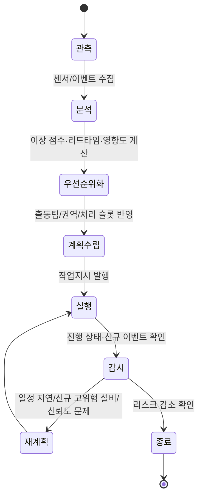

# HeatGrid : 지역난방 운영 AIoT Agent 아키텍처

> **문서 역할**
> 대표 아키텍처 설계서 / 자기소개서·면접 어필용 기준 문서

> **한 줄 정의**
> HeatGrid는 지역난방 기계실 네트워크의 센서 스트림을 바탕으로 이상 징후와 리드타임을 계산하고, 제한된 출동 자원 아래 **무엇을 먼저 어떻게 대응할지 계획한 뒤, 차질이 생기면 다시 재계획하는** 능동형 운영 AIoT Agent다.

---

## 1. 왜 이 프로젝트가 Agent여야 하는가

HeatGrid의 핵심은 `고장을 맞히는 모델`이 아니라 `운영 상황을 읽고 행동을 고르는 시스템`이다.

지역난방 운영은 다음 특징 때문에 단순 대시보드나 정적 룰 엔진만으로는 부족하다.

- 기계실 수가 많아 모든 이상을 동시에 처리할 수 없다.
- 동절기에는 작은 이상도 빠르게 공급 리스크로 번질 수 있다.
- 출동팀 수, 이동 거리, 점검 가능 건수, 부품 준비 상황이 계속 바뀐다.
- 계획을 세운 뒤에도 신규 고위험 이벤트나 일정 지연이 발생한다.

따라서 필요한 것은 `예측값을 보여주는 화면`이 아니라, 센서 상황을 읽고 목표와 제약을 고려해 **계획을 세우고, 실행 상태를 감시하고, 틀어지면 다시 계획을 조정하는 Agent**다.

---

## 2. 문제 정의

> **"도시 열공급 운영의 어려움은 이상을 발견하는 것보다, 여러 기계실 중 어디를 먼저 보고 어떤 조치를 배정해야 전체 공급 리스크를 가장 많이 줄일 수 있는지 판단하는 데 있다."**

### 누가 쓰는가

- 지역난방 운영센터 관제사
- 현장 정비팀
- 설비 신뢰성 엔지니어
- 야간·주말 비전문 당직자

### 무엇을 해결하는가

기계실 스트림을 읽고 아래 순서로 운영 결정을 자동화한다.

`이상 감지 → 위험도 평가 → 우선순위화 → 출동 계획 → 실행 감시 → 차질 감지 → 재계획`

즉, 이 프로젝트의 본질은 `예지보전 모델`이 아니라 **재계획 가능한 운영 의사결정 계층**이다.

---

## 3. 시스템 역할 분리

HeatGrid는 역할을 명확히 분리해야 에이전트로서 설득력이 생긴다.

### 3.1 ML/DL 계층이 담당하는 것

- 기계실별 anomaly score 계산
- 고장 유형 분류
- 위험 상태 도달까지의 리드타임 추정
- 서비스 영향도 추정의 기초 신호 생성

즉, ML/DL은 `상태 해석을 위한 수치적 근거`를 만든다.

### 3.2 우선순위 / 제약 평가 계층이 담당하는 것

- 출동 후보 필터링
- 리드타임, 영향도, 신뢰도, 계절 요인을 반영한 우선순위 산정
- 하루 처리 가능 건수, 권역, 팀 수 같은 제약 반영

즉, 이 계층은 `운영 점수화와 제약 평가`를 담당한다.

### 3.3 AIoT Agent 계층이 담당하는 것

- 현재 목표와 자원 상태를 보고 초기 계획 수립
- 계획 실행 중 차질 감지
- 신규 이벤트와 기존 작업 간 충돌 조정
- 우선순위 재배치와 재계획 수행
- 작업지시서, 설명 문장, 관제 응답 생성

즉, LLM Agent는 예측기가 아니라 **계획·행동·재계획 오케스트레이터**다.

---

## 4. 규모와 깊이의 포인트

HeatGrid는 너무 작은 단일 설비 문제도 아니고, 너무 과장된 국가 단위 제어도 아니다.

- 대상 규모는 `수십~수백 기계실` 수준의 도시 열인프라 네트워크다.
- 단일 장비 이상 탐지가 아니라 `다중 엔티티 동시 운영`을 다룬다.
- 정적 규칙이 아니라 `자원 제약`, `영향도`, `리드타임`, `실행 차질`을 함께 고려한다.
- 설명 가능한 조치와 재계획까지 포함해, 단순 챗봇보다 한 단계 깊은 Agent 구조를 보여준다.

이 규모는 개인 프로젝트로 구현 가능한 현실성을 유지하면서도, 자기소개서에서 `Agent와 인프라 운영 도메인을 함께 이해하고 있다`는 메시지를 주기에 충분하다.

---

## 5. 핵심 상태 루프



이 루프에서 중요한 점은 `재계획`이 예외가 아니라 기본 동작이라는 것이다.

---

## 6. 동적 대응과 재계획 시나리오

### 시나리오 A. 평시 관제

- 여러 기계실이 정상 또는 경미 경고 상태다.
- Agent는 고위험 후보가 없으면 `관찰 유지`를 선택한다.
- 필요 시 관제사에게 요약만 제공하고 출동은 만들지 않는다.

### 시나리오 B. 이상 다발 상황

- 3개 기계실에서 동시에 anomaly score가 상승한다.
- ML 계층은 각 기계실의 리드타임과 영향도를 계산한다.
- 우선순위 엔진은 상위 2개만 오늘 처리 가능하다고 판단한다.
- Agent는 `왜 이 두 곳이 먼저인지`, `남은 1곳은 왜 관찰 대상인지` 설명과 함께 작업지시를 생성한다.

### 시나리오 C. 계획 차질 후 재계획

- 1팀이 현장 지연으로 예정 시간을 넘긴다.
- 동시에 다른 권역에서 더 짧은 리드타임의 신규 고위험 이벤트가 발생한다.
- Agent는 기존 계획을 유지할지, 다른 팀을 재배치할지 판단한다.
- 판단 결과를 반영해 우선순위를 다시 정렬하고 새 작업지시와 변경 사유를 출력한다.

이 시나리오가 있어야 HeatGrid는 `예측 시스템`이 아니라 `능동형 운영 Agent`로 읽힌다.

---

## 7. 자기 수정 구조

HeatGrid는 `00_Agent_가이드`와 연결되는 자기 수정 구조를 가진다.

```text
실행 실패 또는 차질 발생
→ 로그 저장
→ 원인 분류
→ 모델 문제 / 규칙 문제 / 운영 제약 문제 구분
→ 수정 방식 선택
→ rule/skill/가이드 갱신 또는 재실행
→ 재계획 결과 검증
```

### 구체적으로 다루는 실패 유형

- 데이터 이상: 결측치, 비정상 스파이크, 센서 신뢰도 저하
- 모델 이상: 오탐 증가, 리드타임 추정 불안정
- 운영 차질: 출동팀 지연, 점검 건수 초과, 권역 충돌
- Agent 판단 이상: 제약 무시, 설명 불일치, 잘못된 작업지시

### 개선 방식

- 수치 예측 문제가 크면 모델 재학습 또는 피처 개선
- 반복되는 운영 판단 오류는 rule/skill 파일 보강
- 특정 상황 대응 절차는 해결 가이드로 축적

즉, Agent는 단순히 판단만 하는 것이 아니라 **실패 경험을 다음 판단에 반영하는 구조**를 가진다.

---

## 8. 왜 지역난방인가

HeatGrid가 건물 설비와 다른 이유는 운영 스케일과 문제 구조에 있다.

- 건물 HVAC는 대체로 단일 사이트 운영 문제에 가깝다.
- 지역난방 기계실 네트워크는 분산된 다수 설비를 동시에 다룬다.
- 따라서 핵심 산출물도 단일 알람 진단이 아니라 `다중 기계실 대응 계획`이 된다.

또한 PreDist 같은 공개 데이터셋이 있어, 실제 인프라에 가까운 형태로 `조기 탐지 + 우선순위 + 재계획` 구조를 실증할 수 있다.

---

## 9. 면접에서 강조할 문장

> HeatGrid는 센서 데이터를 읽고 고장을 예측하는 데서 끝나는 시스템이 아니라, 지역난방 기계실 네트워크의 상태를 바탕으로 대응 우선순위를 정하고, 자원 제약과 일정 차질을 반영해 계획을 다시 조정하는 운영 AIoT Agent입니다.

> 예측은 ML/DL이 담당하고, Agent는 그 결과를 운영 계획, 작업지시, 설명, 재계획으로 연결하는 의사결정 계층으로 설계했습니다.

---

## 10. 최종 정리

HeatGrid의 본질은 `예지보전 코파일럿`보다 `재계획 가능한 운영 AIoT Agent`라는 표현에 더 가깝다.

이 프로젝트는 다음 네 가지를 함께 보여준다.

- 다중 기계실 인프라 운영이라는 도메인 이해
- 시계열 예측과 리드타임 추정이라는 ML 문제 설정
- 제약 기반 우선순위화라는 운영 의사결정 구조
- 동적 대응과 자기 수정이 가능한 Agent 설계

그래서 HeatGrid는 너무 얕지도, 과장되지도 않은 규모에서 `Agent를 현장 운영 문제에 어떻게 붙이는가`를 보여주는 프로젝트 문서로 쓸 수 있다.
