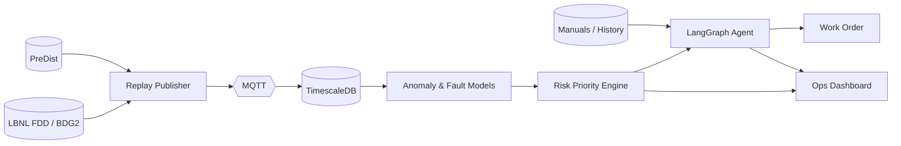

# 주제 18 — HeatGrid Copilot : 건물 HVAC·지역난방 통합 설비 PdM Agent

> **한 줄 정의**
> 공개 건물 HVAC 데이터(LBNL FDD, Building Data Genome 2)와 지역난방 기계실 데이터(PreDist)를 이용해 설비 이상을 사전 탐지하고, 원인 진단·우선순위 산정·작업지시서 생성을 하나로 묶는 **인프라 설비관리 PdM 코파일럿**.

---

## 1. 통합 포지셔닝

BMS-Copilot은 **알람을 원인·조치로 번역하는 건물 설비 코파일럿**이 강점이고, HeatGrid는 **여러 기계실 중 어디를 먼저 봐야 하는지 정하는 다중 엔티티 우선순위화**가 강점이다.

두 주제를 합치면 단순한 건물 챗봇이나 지역난방 이상탐지가 아니라, 아래처럼 정의할 수 있다.

> **건물 HVAC부터 지역난방 기계실까지, 분산된 설비 알람을 위험도·영향도 기준으로 정렬하고 현장 조치까지 연결하는 설비 운영 의사결정 Agent**

핵심은 `이상 탐지` 자체가 아니라 **알람 → 원인 진단 → 우선순위 → 작업지시**로 이어지는 운영 폐루프다.

---

## 2. 문제 정의

> **"설비 데이터와 알람은 많지만, 운영자는 지금 어떤 알람이 진짜 위험한지, 왜 발생했는지, 누구를 어디로 먼저 보내야 하는지를 즉시 판단하기 어렵다."**

### 왜 어려운가

- BMS 알람은 임계치 초과 중심이라 원인·조치로 바로 이어지지 않는다.
- 건물 HVAC와 지역난방 기계실은 모두 온도·압력·유량·밸브 상태처럼 비슷한 계측 신호를 쓰지만, 운영 시스템과 대응 절차가 분리되어 있다.
- 현장 정비팀과 출동 슬롯은 제한되어 모든 알람을 동시에 처리할 수 없다.
- 숙련자의 판단이 암묵지로 남아 있어 비전문 당직자나 신규 인력이 같은 수준으로 대응하기 어렵다.

### 무엇을 해결하는가

센서 스트림 → 이상/고장 탐지 → 원인 진단 → 영향도·리드타임 기반 우선순위 → 작업지시서 생성 → 조치 후 위험도 변화 확인

---

## 3. 사용할 데이터

| 구분 | 데이터 | 쓰임 |
|---|---|---|
| 건물 HVAC | LBNL FDD | 고장 유형 분류, 원인 진단 시나리오 |
| 건물 에너지 | Building Data Genome 2 / ASHRAE GEPIII | 에너지 과소비·운영 비효율 탐지 |
| 지역난방 기계실 | PreDist | 다중 기계실 이상탐지, 리드타임·우선순위화 |

### 데이터 선택 이유

- 세 데이터 모두 공개 데이터 기반이라 1인 MVP에서 재현 가능하다.
- HVAC와 지역난방은 온도·차압·유량·밸브/펌프 상태처럼 제어계측 신호가 유사해 하나의 설비 운영 플랫폼으로 설명하기 좋다.
- BMS 데이터는 **원인 진단과 작업지시**, PreDist는 **다중 설비 우선순위화**를 보여주는 데 적합하다.

---

## 4. 누가 필요한가

- 빌딩·시설 관리자(FM)
- 지역난방 운영센터 관제사
- 현장 정비팀·설비 신뢰성 엔지니어
- 야간/주말 비전문 당직자
- 여러 건물 또는 기계실을 동시에 관리해야 하는 운영 책임자

---

## 5. 핵심 기능

| # | 기능 | 설명 |
|---|---|---|
| 1 | 통합 설비 상태판 | 건물 HVAC와 기계실 상태를 하나의 위험도 기준으로 표시 |
| 2 | 이상·고장 탐지 | 라벨 고장 분류 + 비지도 이상탐지로 전조 포착 |
| 3 | 원인 진단 | 고장 유형, 관련 센서, 과거 이력, 매뉴얼 근거 제시 |
| 4 | 우선순위 산정 | 위험도·리드타임·영향도·출동 가능 자원 기준으로 정렬 |
| 5 | 작업지시서 생성 | 점검 대상, 예상 원인, 1차 조치, 확인 항목 자동 작성 |
| 6 | 코파일럿 질의응답 | "왜 이 설비가 1순위야?", "지금 출동해야 해?"에 답변 |
| 7 | 조치 후 검증 | 조치 전후 이상 점수·위험도 변화 시각화 |

---

## 6. MVP 범위

### 포함

- 공개 데이터셋을 가상 IoT 스트림으로 재생
- 설비별 이상 점수·고장 유형·리드타임 산정
- 위험도 기반 Top-N 우선순위 리스트
- LangGraph 기반 진단·작업지시 Agent
- React 대시보드와 코파일럿 패널

### 제외

- 실제 BMS/CMMS/지역난방 운영 시스템 연동
- PLC/RTU 직접 제어
- 배관망 유체 시뮬레이션
- 실시간 GIS 정식 연동

---

## 7. 시스템 흐름

---

## 8. 기존 서비스 대비 차별점

| 구분 | 기존 BMS/스마트빌딩 | 지역난방 디지털트윈 | HeatGrid Copilot |
|---|---|---|---|
| 초점 | 알람·에너지 최적화 | 기계실/배관망 효율 | **알람 이후 운영 의사결정** |
| 출력 | 대시보드·제어 권고 | 모니터링·시뮬레이션 | **원인·우선순위·작업지시** |
| 범위 | 단일 건물 중심 | 열공급 인프라 중심 | **건물 HVAC + 지역난방 설비 통합 PdM** |
| 데이터 | 현장 폐쇄 데이터 | 현장 폐쇄 데이터 | **공개 데이터로 재현 가능한 MVP** |
| Agent 역할 | 질의응답/요약 | 제한적 | **진단, 우선순위 설명, 작업지시 생성** |

벤치마킹 대상은 BrainBox AI ARIA/Trane, Danfoss Leanheat, Gradyent로 볼 수 있다. 통합 주제의 차별점은 이들과 정면 경쟁하는 제어 최적화가 아니라, **감지 이후의 운영 판단 자동화**를 공개 데이터로 재현하는 것이다.

---

## 9. 기술 스택

- **Backend:** FastAPI, WebSocket, MQTT
- **Storage:** TimescaleDB, PostgreSQL, Redis
- **ML:** scikit-learn, LightGBM/XGBoost, PyTorch Autoencoder
- **Agent:** LangGraph, LangChain, OpenAI 또는 Claude API, RAG
- **Optimization:** 규칙 기반 priority scoring, 필요 시 OR-Tools
- **Frontend:** React, TypeScript, Recharts
- **Ops:** Docker Compose, pytest, MLflow

---

## 10. 평가 지표

### 예측·진단

- 고장 분류 정확도/F1
- 이상탐지 precision/recall
- 리드타임 추정 오차

### 운영 성능

- 고위험 알람 미조치 수 감소
- 우선순위 Top-N 적중률
- 평균 대응 지연 시간 감소
- 작업지시서 생성 시간 감소

### 설명 가능성

- 왜 특정 설비가 우선인지 운영자가 이해 가능한지
- 원인·근거 센서·조치안이 일관되게 연결되는지
- 제약을 무시한 조치 권고가 없는지

---

## 11. 예상 리스크와 방어 논리

### BMS와 HeatGrid를 합치면 범위가 너무 넓지 않나

맞다. 그래서 MVP는 실제 제어가 아니라 **공개 데이터 기반의 진단·우선순위·작업지시 의사결정 레이어**로 제한한다.

### 지역난방 도메인이 어렵지 않나

물리 배관망 모델을 만들지 않는다. PreDist는 다중 기계실 이상과 우선순위화의 데모 데이터로 사용하고, 상세 열역학 모델은 후속 확장으로 둔다.

### 기존 BMS Agent와 비슷하지 않나

단순 코파일럿 질의응답이 아니라, **다중 설비 우선순위와 현장 출동 판단**을 핵심 산출물로 둔다. BMS-Copilot의 진단력과 HeatGrid의 우선순위화를 결합하는 것이 차별점이다.

---

## 12. 최종 정리

HeatGrid와 BMS-Copilot을 따로 두면 각각 `지역난방 이상탐지`, `건물 설비 챗봇`처럼 보일 수 있다.

통합하면 아래 메시지가 더 강하다.

> **HeatGrid Copilot은 건물 HVAC와 지역난방 기계실의 공개 설비 데이터를 기반으로 이상을 탐지하고, 원인 진단·출동 우선순위·작업지시까지 자동화하는 인프라 설비관리 PdM Agent다.**

즉, 이 프로젝트의 본질은 모니터링이 아니라 **설비 운영 의사결정 자동화**다.
